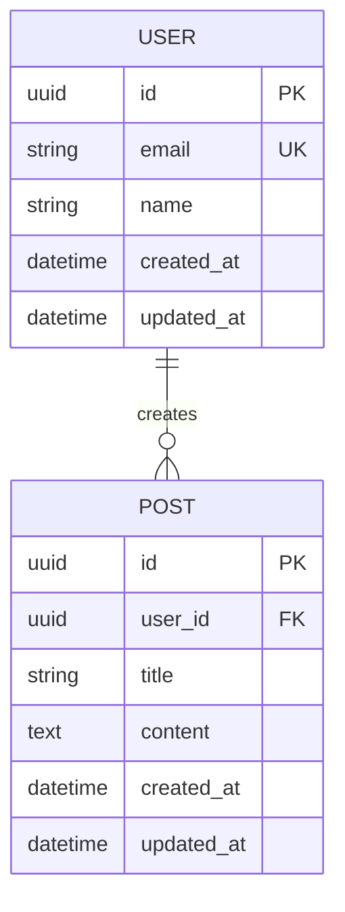

# Database Design Document

## 1. Overview

### 1.1 Purpose
[Brief description of the database's purpose]

### 1.2 Technology Stack
- Database: [PostgreSQL, MySQL, MongoDB, etc.]
- ORM/Query Builder: [Prisma, Drizzle, etc.]
- Migration Tool: [Built-in ORM migrations, etc.]

## 2. Entity-Relationship Diagram



## 3. Data Models

### 3.1 [Entity Name 1]

**Purpose**: [What this entity represents]

**Schema**:
```typescript
interface [EntityName] {
  id: string;                    // UUID, Primary Key
  [field1]: string;              // Description
  [field2]: number;              // Description
  [field3]?: Date;               // Optional field, description
  created_at: Date;              // Timestamp
  updated_at: Date;              // Timestamp
}
```

**Fields**:
| Field | Type | Constraints | Description |
|-------|------|-------------|-------------|
| id | UUID | PK, NOT NULL | Primary identifier |
| [field1] | VARCHAR(255) | NOT NULL, UNIQUE | [Description] |
| [field2] | INTEGER | NOT NULL, DEFAULT 0 | [Description] |
| created_at | TIMESTAMP | NOT NULL | Record creation time |
| updated_at | TIMESTAMP | NOT NULL | Last update time |

**Indexes**:
- `PRIMARY KEY (id)`
- `UNIQUE INDEX idx_[entity]_[field] ON [entity]([field])`
- `INDEX idx_[entity]_created ON [entity](created_at DESC)`

**Relationships**:
- One-to-Many with [Entity2] (via `[entity2_id]`)
- Many-to-Many with [Entity3] (via `[join_table]`)

### 3.2 [Entity Name 2]
[Repeat structure above]

## 4. Relationships

### 4.1 One-to-Many Relationships
| Parent | Child | Foreign Key | Description |
|--------|-------|-------------|-------------|
| [Entity1] | [Entity2] | entity1_id | [Description] |

### 4.2 Many-to-Many Relationships
| Entity 1 | Entity 2 | Join Table | Description |
|----------|----------|------------|-------------|
| [Entity1] | [Entity3] | [join_table] | [Description] |

### 4.3 One-to-One Relationships
| Entity 1 | Entity 2 | Foreign Key | Description |
|----------|----------|-------------|-------------|
| [Entity1] | [Profile] | user_id | [Description] |

## 5. Enums and Constants

### 5.1 [Enum Name]
```typescript
enum [EnumName] {
  VALUE1 = 'value1',
  VALUE2 = 'value2',
  VALUE3 = 'value3'
}
```

**Values**:
- `VALUE1`: [Description]
- `VALUE2`: [Description]
- `VALUE3`: [Description]

## 6. Constraints and Validation

### 6.1 Uniqueness Constraints
- `[entity].[field]` must be unique
- `[entity].([field1], [field2])` must be unique together

### 6.2 Check Constraints
- `[entity].[field]` must be > 0
- `[entity].[field]` must match regex `[pattern]`

### 6.3 Foreign Key Constraints
| Table | Column | References | On Delete | On Update |
|-------|--------|------------|-----------|-----------|
| [child] | [fk_column] | [parent]([pk]) | CASCADE | CASCADE |

## 7. Indexes

### 7.1 Performance Indexes
```sql
CREATE INDEX idx_[table]_[column] ON [table]([column]);
CREATE INDEX idx_[table]_composite ON [table]([column1], [column2]);
```

**Rationale**: [Why this index is needed]

### 7.2 Full-Text Search Indexes
```sql
CREATE INDEX idx_[table]_fulltext ON [table] USING GIN(to_tsvector('english', [column]));
```

## 8. Migration Strategy

### 8.1 Initial Setup
```bash
# Create initial migration
npm run db:migrate:create init
```

### 8.2 Migration Sequence
1. Create core tables (users, etc.)
2. Create feature tables
3. Create join tables
4. Add indexes
5. Add constraints

### 8.3 Rollback Strategy
[How to handle rollbacks if needed]

## 9. Data Seeding

### 9.1 Development Data
```typescript
// Example seed data
const seedUsers = [
  { email: 'user1@example.com', name: 'User 1' },
  { email: 'user2@example.com', name: 'User 2' },
];
```

### 9.2 Test Data
[Description of test data requirements]

## 10. Performance Considerations

### 10.1 Query Optimization
- Use indexes for frequently queried fields
- Implement pagination for large result sets
- Use connection pooling

### 10.2 Caching Strategy
- Cache frequently accessed data
- Invalidate cache on updates
- Use Redis for session storage

### 10.3 Scaling Strategy
- Read replicas for read-heavy workloads
- Partitioning strategy for large tables
- Archive strategy for old data

## 11. Security

### 11.1 Data Encryption
- Encrypt sensitive fields at rest
- Use parameterized queries to prevent SQL injection
- Hash passwords with bcrypt (cost factor: 12)

### 11.2 Access Control
- Row-level security policies
- Role-based access control
- Audit logging

## 12. Backup and Recovery

### 12.1 Backup Schedule
- Daily automated backups
- Retention period: [X] days
- Off-site backup storage

### 12.2 Recovery Procedure
[Steps to recover from backup]

## 13. Monitoring

### 13.1 Metrics to Track
- Query performance
- Connection pool usage
- Table sizes
- Index usage

### 13.2 Alerts
- Slow query alerts (> [X] ms)
- Connection pool exhaustion
- Disk space warnings

## 14. Future Considerations

- [Potential schema changes]
- [Scaling requirements]
- [New feature support]
