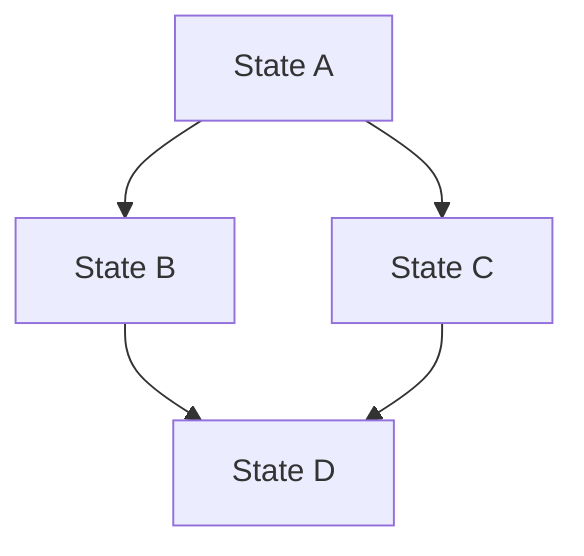

# State Complexity Statement: [Page Name]

## 1. Executive Summary

**Page**: [Page Name]
**Complexity Score**: [1-10]
**Recommended Approach**: [useState / useReducer / Context / Zustand / Redux]
**Assessment Date**: [Date]

## 2. State Inventory

### 2.1 UI State
| State Variable | Type | Purpose | Update Frequency | Scope |
|----------------|------|---------|-----------------|-------|
| [stateName1] | boolean | [Purpose] | [High/Medium/Low] | [Local/Global] |
| [stateName2] | string | [Purpose] | [High/Medium/Low] | [Local/Global] |

**UI State Count**: [Number]
**Complexity Contribution**: [1-3 points]

### 2.2 Server State
| Data | Source | Caching | Refetch Strategy | Error Handling |
|------|--------|---------|------------------|----------------|
| [data1] | [API endpoint] | [Yes/No] | [Strategy] | [Approach] |
| [data2] | [API endpoint] | [Yes/No] | [Strategy] | [Approach] |

**Server State Count**: [Number]
**Complexity Contribution**: [1-3 points]

### 2.3 Form State
| Form | Fields Count | Validation | Dependencies | Submission |
|------|--------------|------------|--------------|------------|
| [form1] | [Number] | [Type] | [Yes/No] | [Async/Sync] |

**Form Count**: [Number]
**Complexity Contribution**: [1-2 points]

### 2.4 Navigation State
| State | Purpose | Persistence | Sync Required |
|-------|---------|-------------|---------------|
| [navState] | [Purpose] | [Yes/No] | [Yes/No] |

**Navigation State Count**: [Number]
**Complexity Contribution**: [0-1 points]

## 3. State Relationships

### 3.1 State Dependencies


**Dependency Complexity**: [Simple / Moderate / Complex]

### 3.2 State Update Patterns
| Pattern | Frequency | Complexity |
|---------|-----------|------------|
| Single state update | [High/Medium/Low] | Low |
| Multiple related updates | [High/Medium/Low] | Medium |
| Cascading updates | [High/Medium/Low] | High |
| Async state updates | [High/Medium/Low] | High |

## 4. Side Effects Analysis

### 4.1 Side Effects Inventory
| Side Effect | Trigger | Cleanup Required | Dependencies |
|-------------|---------|------------------|--------------|
| [effect1] | [Trigger] | [Yes/No] | [deps] |
| [effect2] | [Trigger] | [Yes/No] | [deps] |

**Side Effects Count**: [Number]
**Complexity Contribution**: [0-2 points]

### 4.2 Race Conditions Risk
- [ ] Multiple async operations on same state
- [ ] Rapid user interactions
- [ ] Network-dependent updates
- [ ] Timer-based updates

**Race Condition Risk**: [Low / Medium / High]

## 5. Performance Considerations

### 5.1 Render Frequency
| Component | Estimated Renders/Minute | Optimization Needed |
|-----------|-------------------------|---------------------|
| [Component1] | [Number] | [Yes/No] |
| [Component2] | [Number] | [Yes/No] |

### 5.2 Memory Concerns
- Large data structures: [Yes/No]
- Memory leaks risk: [Low/Medium/High]
- Cleanup required: [Yes/No]

## 6. Complexity Scoring

### 6.1 Scoring Breakdown

| Factor | Weight | Score | Weighted Score |
|--------|--------|-------|----------------|
| Number of state variables | 20% | [1-10] | [Calculated] |
| State relationships | 20% | [1-10] | [Calculated] |
| Side effects | 15% | [1-10] | [Calculated] |
| Async operations | 15% | [1-10] | [Calculated] |
| Form complexity | 10% | [1-10] | [Calculated] |
| Cross-component sharing | 10% | [1-10] | [Calculated] |
| Performance concerns | 10% | [1-10] | [Calculated] |

**Total Complexity Score**: [Sum of weighted scores]

### 6.2 Scoring Guidelines

**1-3: Simple**
- Few state variables (< 5)
- No complex dependencies
- Minimal side effects
- Local state sufficient

**4-6: Moderate**
- Multiple state variables (5-10)
- Some dependencies
- Several side effects
- May need useReducer or Context

**7-8: Complex**
- Many state variables (> 10)
- Complex dependencies
- Many side effects
- Needs state management library

**9-10: Very Complex**
- Extensive state (> 20 variables)
- Highly interconnected
- Complex async patterns
- Definitely needs state management library

## 7. Recommended State Management Approach

### 7.1 Primary Recommendation

**Approach**: [useState / useReducer / Context / Zustand / Redux Toolkit]

**Rationale**:
- [Reason 1]
- [Reason 2]
- [Reason 3]

### 7.2 Implementation Structure

```typescript
// Recommended structure

// For useState (Score 1-3)
const [state, setState] = useState(initialValue);

// For useReducer (Score 4-6)
type State = {
  // state shape
};

type Action = 
  | { type: 'ACTION_1'; payload: Type1 }
  | { type: 'ACTION_2'; payload: Type2 };

const reducer = (state: State, action: Action): State => {
  // reducer logic
};

const [state, dispatch] = useReducer(reducer, initialState);

// For Zustand (Score 7-8)
import { create } from 'zustand';

interface Store {
  // state
  // actions
}

const useStore = create<Store>((set, get) => ({
  // implementation
}));

// For Redux Toolkit (Score 9-10)
import { createSlice } from '@reduxjs/toolkit';

const slice = createSlice({
  name: 'feature',
  initialState,
  reducers: {
    // actions
  }
});
```

### 7.3 Alternative Approaches

**Alternative 1**: [Approach]
- **Use Case**: [When to consider this]
- **Pros**: [Advantages]
- **Cons**: [Disadvantages]

**Alternative 2**: [Approach]
- **Use Case**: [When to consider this]
- **Pros**: [Advantages]
- **Cons**: [Disadvantages]

## 8. State Organization

### 8.1 Recommended File Structure

```
[page]/
├── components/
│   ├── ComponentA.tsx
│   └── ComponentB.tsx
├── hooks/
│   ├── use[Feature].ts       # Custom hooks
│   └── use[Feature]State.ts  # State management hook
├── store/                     # If using Zustand/Redux
│   └── [feature]Store.ts
├── types/
│   └── [feature].types.ts
└── page.tsx
```

### 8.2 State Colocation Strategy

**Colocate**: [Which state should be kept local]
- [State 1] - Keep in component
- [State 2] - Keep in component

**Lift Up**: [Which state should be lifted]
- [State 3] - Lift to parent
- [State 4] - Lift to context/store

**Share Globally**: [Which state should be global]
- [State 5] - Put in store
- [State 6] - Put in store

## 9. Testing Implications

### 9.1 Testing Complexity
**Estimated Test Complexity**: [Low / Medium / High]

**Challenges**:
- [Challenge 1]
- [Challenge 2]

### 9.2 Testing Strategy
```typescript
// Example test structure based on complexity

describe('[Page] State Management', () => {
  it('handles initial state correctly', () => {
    // Test
  });
  
  it('handles state updates', () => {
    // Test
  });
  
  it('handles side effects', () => {
    // Test
  });
  
  it('handles error states', () => {
    // Test
  });
});
```

## 10. Migration Path

### 10.1 If Complexity Grows
**Trigger for Migration**: [What indicates need for upgrade]

**Migration Steps**:
1. [Step 1]
2. [Step 2]
3. [Step 3]

**Estimated Effort**: [Hours/Days]

### 10.2 Refactoring Opportunities
- [ ] [Opportunity 1]
- [ ] [Opportunity 2]
- [ ] [Opportunity 3]

## 11. Risks and Mitigations

| Risk | Impact | Likelihood | Mitigation |
|------|--------|------------|------------|
| [Risk 1] | [High/Med/Low] | [High/Med/Low] | [Strategy] |
| [Risk 2] | [High/Med/Low] | [High/Med/Low] | [Strategy] |

## 12. Monitoring and Maintenance

### 12.1 Metrics to Track
- Re-render count
- State update frequency
- Memory usage
- Performance metrics

### 12.2 Review Triggers
- [ ] Significant new features added
- [ ] Performance issues detected
- [ ] Code complexity increases
- [ ] Every 6 months

## 13. Decision Log

| Date | Decision | Rationale | Outcome |
|------|----------|-----------|---------|
| [Date] | [Decision made] | [Why] | [Result] |

## 14. Recommendations

### 14.1 Immediate Actions
1. [Action 1]
2. [Action 2]
3. [Action 3]

### 14.2 Future Considerations
- [Consideration 1]
- [Consideration 2]

### 14.3 Best Practices
- [Practice 1]
- [Practice 2]
- [Practice 3]
