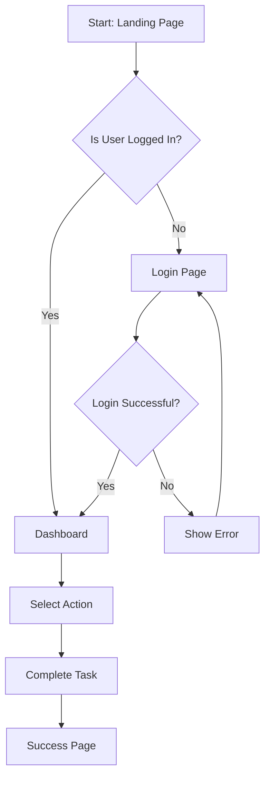
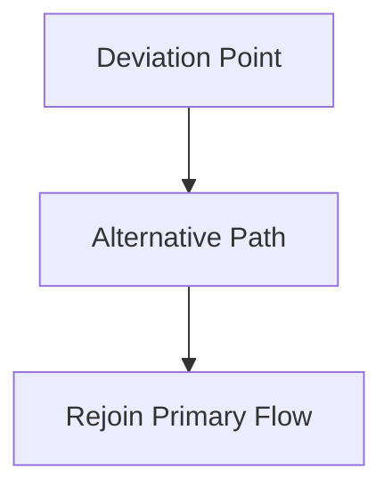
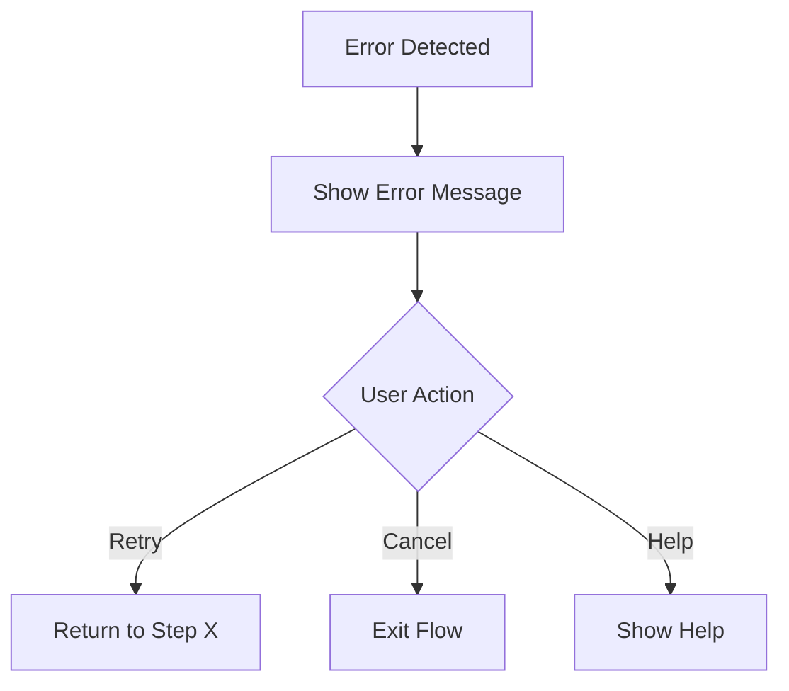
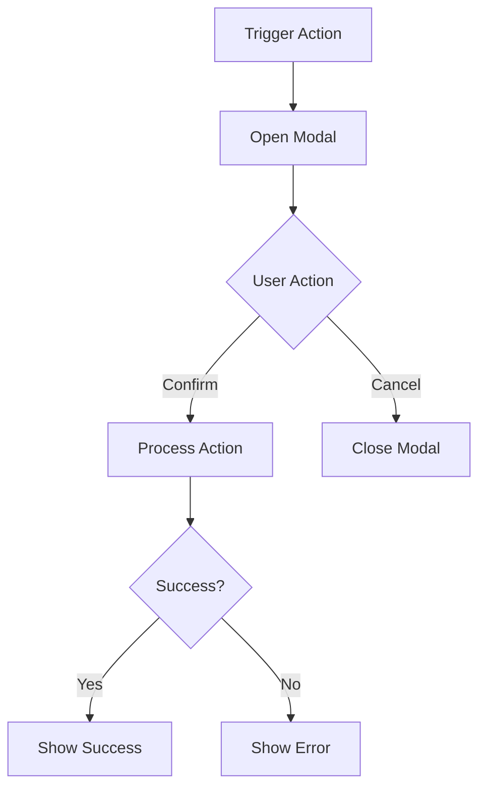

# User Flow Document

## 1. Overview

### 1.1 Purpose
[Brief description of what user flows this document covers]

### 1.2 User Personas
- [Persona 1]: [Brief description]
- [Persona 2]: [Brief description]

## 2. Primary User Flows

### 2.1 [Flow Name 1]: [Brief Description]

**Goal**: [What the user wants to accomplish]

**Entry Point**: [Where the user starts - e.g., Home page, Direct link]

**Preconditions**: 
- [Condition 1 - e.g., User is logged in]
- [Condition 2]

**Flow Diagram**:

**Steps**:
1. **[Page/Screen Name]**
   - User Action: [What the user does]
   - System Response: [What the system does]
   - Navigation: [Where the user goes next]
   - Validation: [Any validation that occurs]

2. **[Next Page/Screen Name]**
   - User Action: [What the user does]
   - System Response: [What the system does]
   - Navigation: [Where the user goes next]

3. [Continue for all steps...]

**Success Outcome**: [What happens when flow completes successfully]

**Exit Points**: 
- Success: [Where user ends up on success]
- Cancel: [Where user ends up if they cancel]
- Error: [Where user ends up on error]

### 2.2 [Flow Name 2]: [Brief Description]
[Repeat structure above]

## 3. Alternative Flows

### 3.1 Alternative Flow: [Scenario Name]

**Trigger**: [What causes this alternative flow]

**Difference from Primary Flow**: [How this differs]

**Flow**:

## 4. Error Flows

### 4.1 Error: [Error Scenario Name]

**Trigger**: [What causes this error]

**Error Handling**:
1. System detects [condition]
2. Display error message: "[Error message text]"
3. Provide recovery options:
   - Option 1: [Description]
   - Option 2: [Description]

**Recovery Flow**:

## 5. Edge Cases

### 5.1 Edge Case: [Scenario Name]

**Scenario**: [Description of edge case]

**Frequency**: [Common / Uncommon / Rare]

**Handling**:
- [How the system handles this case]
- [User experience considerations]

## 6. Page Transitions

### 6.1 Transition Matrix

| From Page | To Page | Trigger | Animation |
|-----------|---------|---------|-----------|
| [Page A] | [Page B] | [Button click] | [Slide right] |
| [Page B] | [Page C] | [Form submit] | [Fade in] |

### 6.2 Navigation Patterns

**Primary Navigation**:
- [Nav item 1] → [Destination]
- [Nav item 2] → [Destination]

**Secondary Navigation**:
- [Breadcrumbs / Tabs / etc.]

**Deep Linking**:
- [URL pattern] → [Entry point]

## 7. State Management

### 7.1 Session State
- [State item 1]: [When it's set/cleared]
- [State item 2]: [When it's set/cleared]

### 7.2 Persistence Requirements
- [Data that needs to persist]: [Storage method]
- [Data that can be temporary]: [Storage method]

## 8. Loading States

### 8.1 Async Operations
| Operation | Loading Indicator | Timeout | Error Handling |
|-----------|------------------|---------|----------------|
| [API call 1] | [Spinner] | [5s] | [Show error message] |
| [API call 2] | [Skeleton] | [10s] | [Retry option] |

## 9. Modal and Overlay Flows

### 9.1 [Modal Name]

**Trigger**: [What opens the modal]

**Content**: [What's in the modal]

**Actions**:
- Primary: [Button label] → [Result]
- Secondary: [Button label] → [Result]
- Close: [X button / Outside click] → [Result]

**Diagram**:

## 10. Mobile-Specific Flows

### 10.1 Responsive Behavior
- Desktop: [Description of desktop flow]
- Tablet: [Any differences for tablet]
- Mobile: [Any differences for mobile]

### 10.2 Touch Interactions
- Swipe: [What happens]
- Long press: [What happens]
- Pull to refresh: [What happens]

## 11. Accessibility Flows

### 11.1 Keyboard Navigation
- Tab order: [Description]
- Shortcuts: [List of keyboard shortcuts]

### 11.2 Screen Reader Flow
- [How screen reader users navigate]
- [Important ARIA labels]

## 12. Analytics and Tracking

### 12.1 Events to Track
| Event | Trigger | Data Captured |
|-------|---------|---------------|
| [Event 1] | [When it fires] | [What data] |
| [Event 2] | [When it fires] | [What data] |

## 13. Performance Considerations

### 13.1 Critical User Paths
- [Path 1]: Should load in < [X] seconds
- [Path 2]: Should complete in < [X] steps

### 13.2 Optimization Priorities
1. [Most critical flow to optimize]
2. [Second priority]
3. [Third priority]
