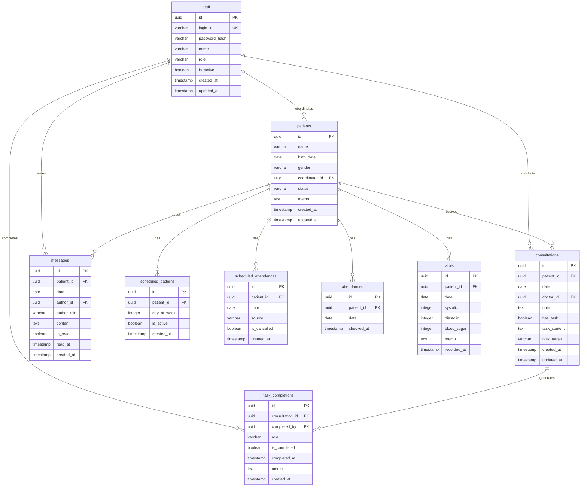

# Database Design

## Overview

- **사용 DB**: Supabase (PostgreSQL)
- **인증**: Supabase Auth 미사용, 자체 구현 (bcrypt + JWT)
- **RLS**: 비활성화
- **주요 엔티티**: staff, patients, scheduled_patterns, scheduled_attendances, attendances, vitals, consultations, task_completions, messages, daily_stats

## ERD



## Tables

### staff (직원/의사/관리자)

| Column | Type | Constraints | Description |
|--------|------|-------------|-------------|
| id | UUID | PK, DEFAULT gen_random_uuid() | 직원 고유 ID |
| login_id | VARCHAR(50) | UNIQUE, NOT NULL | 로그인 ID |
| password_hash | VARCHAR(255) | NOT NULL | bcrypt 해시 비밀번호 |
| name | VARCHAR(100) | NOT NULL | 직원 이름 |
| role | VARCHAR(20) | NOT NULL, CHECK | 'doctor', 'coordinator', 'nurse', 'admin' |
| is_active | BOOLEAN | DEFAULT true | 활성 상태 |
| created_at | TIMESTAMPTZ | DEFAULT NOW() | 생성일시 |
| updated_at | TIMESTAMPTZ | DEFAULT NOW() | 수정일시 |

#### TypeScript Interface
```typescript
interface Staff {
  id: string;
  login_id: string;
  password_hash: string;
  name: string;
  role: 'doctor' | 'coordinator' | 'nurse' | 'admin';
  is_active: boolean;
  created_at: string;
  updated_at: string;
}

// 클라이언트에서 사용할 타입 (password_hash 제외)
interface StaffPublic {
  id: string;
  login_id: string;
  name: string;
  role: 'doctor' | 'coordinator' | 'nurse' | 'admin';
  is_active: boolean;
  created_at: string;
  updated_at: string;
}
```

#### SQL Migration
```sql
CREATE TABLE IF NOT EXISTS staff (
  id UUID PRIMARY KEY DEFAULT gen_random_uuid(),
  login_id VARCHAR(50) UNIQUE NOT NULL,
  password_hash VARCHAR(255) NOT NULL,
  name VARCHAR(100) NOT NULL,
  role VARCHAR(20) NOT NULL,
  is_active BOOLEAN DEFAULT true,
  created_at TIMESTAMPTZ DEFAULT NOW(),
  updated_at TIMESTAMPTZ DEFAULT NOW()
);

ALTER TABLE staff
ADD CONSTRAINT chk_staff_role
CHECK (role IN ('doctor', 'coordinator', 'nurse', 'admin'));

CREATE INDEX idx_staff_login_id ON staff(login_id);
CREATE INDEX idx_staff_role ON staff(role);

-- updated_at trigger
CREATE TRIGGER trg_staff_updated_at
  BEFORE UPDATE ON staff
  FOR EACH ROW EXECUTE FUNCTION update_updated_at();
```

---

### patients (환자)

| Column | Type | Constraints | Description |
|--------|------|-------------|-------------|
| id | UUID | PK, DEFAULT gen_random_uuid() | 환자 고유 ID |
| name | VARCHAR(100) | NOT NULL | 환자 이름 |
| birth_date | DATE | | 생년월일 |
| gender | VARCHAR(10) | CHECK | 'M', 'F' |
| coordinator_id | UUID | FK → staff.id | 담당 코디네이터 |
| status | VARCHAR(20) | DEFAULT 'active', CHECK | 'active', 'discharged', 'suspended' |
| memo | TEXT | | 관리자 메모 |
| created_at | TIMESTAMPTZ | DEFAULT NOW() | 생성일시 |
| updated_at | TIMESTAMPTZ | DEFAULT NOW() | 수정일시 |

#### TypeScript Interface
```typescript
interface Patient {
  id: string;
  name: string;
  birth_date: string | null;
  gender: 'M' | 'F' | null;
  coordinator_id: string | null;
  status: 'active' | 'discharged' | 'suspended';
  memo: string | null;
  created_at: string;
  updated_at: string;
}

// 담당 코디 정보 포함
interface PatientWithCoordinator extends Patient {
  coordinator_name?: string;
}
```

#### SQL Migration
```sql
CREATE TABLE IF NOT EXISTS patients (
  id UUID PRIMARY KEY DEFAULT gen_random_uuid(),
  name VARCHAR(100) NOT NULL,
  birth_date DATE,
  gender VARCHAR(10),
  coordinator_id UUID REFERENCES staff(id),
  status VARCHAR(20) DEFAULT 'active',
  memo TEXT,
  created_at TIMESTAMPTZ DEFAULT NOW(),
  updated_at TIMESTAMPTZ DEFAULT NOW()
);

ALTER TABLE patients
ADD CONSTRAINT chk_patients_gender
CHECK (gender IN ('M', 'F'));

ALTER TABLE patients
ADD CONSTRAINT chk_patients_status
CHECK (status IN ('active', 'discharged', 'suspended'));

CREATE INDEX idx_patients_name ON patients(name);
CREATE INDEX idx_patients_coordinator ON patients(coordinator_id);
CREATE INDEX idx_patients_status ON patients(status);

-- updated_at trigger
CREATE TRIGGER trg_patients_updated_at
  BEFORE UPDATE ON patients
  FOR EACH ROW EXECUTE FUNCTION update_updated_at();
```

---

### scheduled_patterns (기본 출석 스케줄)

| Column | Type | Constraints | Description |
|--------|------|-------------|-------------|
| id | UUID | PK, DEFAULT gen_random_uuid() | 패턴 고유 ID |
| patient_id | UUID | FK → patients.id, NOT NULL | 환자 ID |
| day_of_week | INTEGER | NOT NULL, CHECK | 0=일, 1=월, ..., 6=토 |
| is_active | BOOLEAN | DEFAULT true | 활성 상태 |
| created_at | TIMESTAMPTZ | DEFAULT NOW() | 생성일시 |

**UNIQUE 제약**: (patient_id, day_of_week)

**예시**: 홍길동이 월/수/금 출석하면 3개 row (day_of_week: 1, 3, 5)

#### TypeScript Interface
```typescript
interface ScheduledPattern {
  id: string;
  patient_id: string;
  day_of_week: number; // 0-6
  is_active: boolean;
  created_at: string;
}

// 환자별 패턴 요약
interface PatientSchedulePattern {
  patient_id: string;
  active_days: number[]; // [1, 3, 5] 형태
}
```

#### SQL Migration
```sql
CREATE TABLE IF NOT EXISTS scheduled_patterns (
  id UUID PRIMARY KEY DEFAULT gen_random_uuid(),
  patient_id UUID NOT NULL REFERENCES patients(id) ON DELETE CASCADE,
  day_of_week INTEGER NOT NULL,
  is_active BOOLEAN DEFAULT true,
  created_at TIMESTAMPTZ DEFAULT NOW(),

  UNIQUE(patient_id, day_of_week)
);

ALTER TABLE scheduled_patterns
ADD CONSTRAINT chk_day_of_week
CHECK (day_of_week BETWEEN 0 AND 6);

CREATE INDEX idx_scheduled_patterns_patient ON scheduled_patterns(patient_id);
CREATE INDEX idx_scheduled_patterns_day ON scheduled_patterns(day_of_week);
```

---

### scheduled_attendances (일일 예정 출석)

| Column | Type | Constraints | Description |
|--------|------|-------------|-------------|
| id | UUID | PK, DEFAULT gen_random_uuid() | 예정 고유 ID |
| patient_id | UUID | FK → patients.id, NOT NULL | 환자 ID |
| date | DATE | NOT NULL | 예정 날짜 |
| source | VARCHAR(20) | DEFAULT 'auto', CHECK | 'auto' (패턴 자동생성), 'manual' (수동) |
| is_cancelled | BOOLEAN | DEFAULT false | 예정 취소 여부 |
| created_at | TIMESTAMPTZ | DEFAULT NOW() | 생성일시 |

**UNIQUE 제약**: (patient_id, date)

#### TypeScript Interface
```typescript
interface ScheduledAttendance {
  id: string;
  patient_id: string;
  date: string;
  source: 'auto' | 'manual';
  is_cancelled: boolean;
  created_at: string;
}
```

#### SQL Migration
```sql
CREATE TABLE IF NOT EXISTS scheduled_attendances (
  id UUID PRIMARY KEY DEFAULT gen_random_uuid(),
  patient_id UUID NOT NULL REFERENCES patients(id) ON DELETE CASCADE,
  date DATE NOT NULL,
  source VARCHAR(20) DEFAULT 'auto',
  is_cancelled BOOLEAN DEFAULT false,
  created_at TIMESTAMPTZ DEFAULT NOW(),

  UNIQUE(patient_id, date)
);

ALTER TABLE scheduled_attendances
ADD CONSTRAINT chk_source
CHECK (source IN ('auto', 'manual'));

CREATE INDEX idx_scheduled_attendances_date ON scheduled_attendances(date);
CREATE INDEX idx_scheduled_attendances_patient ON scheduled_attendances(patient_id);
```

---

### attendances (실제 출석)

| Column | Type | Constraints | Description |
|--------|------|-------------|-------------|
| id | UUID | PK, DEFAULT gen_random_uuid() | 출석 고유 ID |
| patient_id | UUID | FK → patients.id, NOT NULL | 환자 ID |
| date | DATE | NOT NULL | 출석 날짜 |
| checked_at | TIMESTAMPTZ | DEFAULT NOW() | 출석 체크 시각 |

**UNIQUE 제약**: (patient_id, date) - 하루에 한 번만 출석 가능

#### TypeScript Interface
```typescript
interface Attendance {
  id: string;
  patient_id: string;
  date: string;
  checked_at: string;
}
```

#### SQL Migration
```sql
CREATE TABLE IF NOT EXISTS attendances (
  id UUID PRIMARY KEY DEFAULT gen_random_uuid(),
  patient_id UUID NOT NULL REFERENCES patients(id) ON DELETE CASCADE,
  date DATE NOT NULL,
  checked_at TIMESTAMPTZ DEFAULT NOW(),

  UNIQUE(patient_id, date)
);

CREATE INDEX idx_attendances_date ON attendances(date);
CREATE INDEX idx_attendances_patient ON attendances(patient_id);
```

---

### vitals (활력징후)

| Column | Type | Constraints | Description |
|--------|------|-------------|-------------|
| id | UUID | PK, DEFAULT gen_random_uuid() | 기록 고유 ID |
| patient_id | UUID | FK → patients.id, NOT NULL | 환자 ID |
| date | DATE | NOT NULL | 기록 날짜 |
| systolic | INTEGER | | 수축기 혈압 (mmHg) |
| diastolic | INTEGER | | 이완기 혈압 (mmHg) |
| blood_sugar | INTEGER | | 혈당 (mg/dL) |
| memo | TEXT | | 기타 기록 |
| recorded_at | TIMESTAMPTZ | DEFAULT NOW() | 기록 시각 |

**UNIQUE 제약**: (patient_id, date) - 현재는 하루에 한 번만 기록 가능

> **참고**: 하루에 여러 번 측정이 필요한 경우 UNIQUE 제약 제거 고려

#### TypeScript Interface
```typescript
interface Vitals {
  id: string;
  patient_id: string;
  date: string;
  systolic: number | null;
  diastolic: number | null;
  blood_sugar: number | null;
  memo: string | null;
  recorded_at: string;
}
```

#### SQL Migration
```sql
CREATE TABLE IF NOT EXISTS vitals (
  id UUID PRIMARY KEY DEFAULT gen_random_uuid(),
  patient_id UUID NOT NULL REFERENCES patients(id) ON DELETE CASCADE,
  date DATE NOT NULL,
  systolic INTEGER,
  diastolic INTEGER,
  blood_sugar INTEGER,
  memo TEXT,
  recorded_at TIMESTAMPTZ DEFAULT NOW(),

  UNIQUE(patient_id, date)
);

CREATE INDEX idx_vitals_date ON vitals(date);
CREATE INDEX idx_vitals_patient ON vitals(patient_id);
```

---

### consultations (진찰 기록)

| Column | Type | Constraints | Description |
|--------|------|-------------|-------------|
| id | UUID | PK, DEFAULT gen_random_uuid() | 진찰 고유 ID |
| patient_id | UUID | FK → patients.id, NOT NULL | 환자 ID |
| date | DATE | NOT NULL | 진찰 날짜 |
| doctor_id | UUID | FK → staff.id, NOT NULL | 진찰 의사 ID |
| note | TEXT | | 면담 내용, 상태, 증상 |
| has_task | BOOLEAN | DEFAULT false | 처리 필요 항목 있음 여부 |
| task_content | TEXT | | 지시/요청 내용 |
| task_target | VARCHAR(20) | CHECK | 'coordinator', 'nurse', 'both' |
| created_at | TIMESTAMPTZ | DEFAULT NOW() | 생성일시 |
| updated_at | TIMESTAMPTZ | DEFAULT NOW() | 수정일시 |

**UNIQUE 제약**: (patient_id, date) - 하루에 한 번만 진찰

#### TypeScript Interface
```typescript
interface Consultation {
  id: string;
  patient_id: string;
  date: string;
  doctor_id: string;
  note: string | null;
  has_task: boolean;
  task_content: string | null;
  task_target: 'coordinator' | 'nurse' | 'both' | null;
  created_at: string;
  updated_at: string;
}

// 의사 및 환자 정보 포함
interface ConsultationWithDetails extends Consultation {
  patient_name: string;
  doctor_name: string;
  coordinator_name?: string;
}
```

#### SQL Migration
```sql
CREATE TABLE IF NOT EXISTS consultations (
  id UUID PRIMARY KEY DEFAULT gen_random_uuid(),
  patient_id UUID NOT NULL REFERENCES patients(id) ON DELETE CASCADE,
  date DATE NOT NULL,
  doctor_id UUID NOT NULL REFERENCES staff(id),
  note TEXT,
  has_task BOOLEAN DEFAULT false,
  task_content TEXT,
  task_target VARCHAR(20),
  created_at TIMESTAMPTZ DEFAULT NOW(),
  updated_at TIMESTAMPTZ DEFAULT NOW(),

  UNIQUE(patient_id, date)
);

ALTER TABLE consultations
ADD CONSTRAINT chk_task_target
CHECK (task_target IS NULL OR task_target IN ('coordinator', 'nurse', 'both'));

CREATE INDEX idx_consultations_date ON consultations(date);
CREATE INDEX idx_consultations_patient ON consultations(patient_id);
CREATE INDEX idx_consultations_doctor ON consultations(doctor_id);
CREATE INDEX idx_consultations_has_task ON consultations(has_task) WHERE has_task = true;

-- updated_at trigger
CREATE TRIGGER trg_consultations_updated_at
  BEFORE UPDATE ON consultations
  FOR EACH ROW EXECUTE FUNCTION update_updated_at();
```

---

### task_completions (지시 처리 기록)

| Column | Type | Constraints | Description |
|--------|------|-------------|-------------|
| id | UUID | PK, DEFAULT gen_random_uuid() | 처리 기록 고유 ID |
| consultation_id | UUID | FK → consultations.id, NOT NULL | 진찰 기록 ID |
| completed_by | UUID | FK → staff.id, NOT NULL | 처리한 직원 ID |
| role | VARCHAR(20) | NOT NULL, CHECK | 'coordinator', 'nurse' |
| is_completed | BOOLEAN | DEFAULT false | 처리 완료 여부 |
| completed_at | TIMESTAMPTZ | | 처리 완료 시각 |
| memo | TEXT | | 처리 메모 |
| created_at | TIMESTAMPTZ | DEFAULT NOW() | 생성일시 |

> **참고**: task_target이 'both'인 경우 coordinator, nurse 각각 별도 row 생성

#### TypeScript Interface
```typescript
interface TaskCompletion {
  id: string;
  consultation_id: string;
  completed_by: string;
  role: 'coordinator' | 'nurse';
  is_completed: boolean;
  completed_at: string | null;
  memo: string | null;
  created_at: string;
}
```

#### SQL Migration
```sql
CREATE TABLE IF NOT EXISTS task_completions (
  id UUID PRIMARY KEY DEFAULT gen_random_uuid(),
  consultation_id UUID NOT NULL REFERENCES consultations(id) ON DELETE CASCADE,
  completed_by UUID NOT NULL REFERENCES staff(id),
  role VARCHAR(20) NOT NULL,
  is_completed BOOLEAN DEFAULT false,
  completed_at TIMESTAMPTZ,
  memo TEXT,
  created_at TIMESTAMPTZ DEFAULT NOW()
);

ALTER TABLE task_completions
ADD CONSTRAINT chk_completion_role
CHECK (role IN ('coordinator', 'nurse'));

CREATE INDEX idx_task_completions_consultation ON task_completions(consultation_id);
CREATE INDEX idx_task_completions_staff ON task_completions(completed_by);
CREATE INDEX idx_task_completions_incomplete ON task_completions(is_completed) WHERE is_completed = false;
```

---

### messages (전달사항 - 직원 → 의사)

| Column | Type | Constraints | Description |
|--------|------|-------------|-------------|
| id | UUID | PK, DEFAULT gen_random_uuid() | 메시지 고유 ID |
| patient_id | UUID | FK → patients.id, NOT NULL | 환자 ID |
| date | DATE | NOT NULL | 해당 진찰일 |
| author_id | UUID | FK → staff.id, NOT NULL | 작성자 ID |
| author_role | VARCHAR(20) | NOT NULL, CHECK | 'coordinator', 'nurse' |
| content | TEXT | NOT NULL | 전달 내용 |
| is_read | BOOLEAN | DEFAULT false | 의사 확인 여부 |
| read_at | TIMESTAMPTZ | | 확인 시각 |
| created_at | TIMESTAMPTZ | DEFAULT NOW() | 작성 시각 |

#### TypeScript Interface
```typescript
interface Message {
  id: string;
  patient_id: string;
  date: string;
  author_id: string;
  author_role: 'coordinator' | 'nurse';
  content: string;
  is_read: boolean;
  read_at: string | null;
  created_at: string;
}

// 작성자 이름 포함
interface MessageWithAuthor extends Message {
  author_name: string;
}
```

#### SQL Migration
```sql
CREATE TABLE IF NOT EXISTS messages (
  id UUID PRIMARY KEY DEFAULT gen_random_uuid(),
  patient_id UUID NOT NULL REFERENCES patients(id) ON DELETE CASCADE,
  date DATE NOT NULL,
  author_id UUID NOT NULL REFERENCES staff(id),
  author_role VARCHAR(20) NOT NULL,
  content TEXT NOT NULL,
  is_read BOOLEAN DEFAULT false,
  read_at TIMESTAMPTZ,
  created_at TIMESTAMPTZ DEFAULT NOW()
);

ALTER TABLE messages
ADD CONSTRAINT chk_author_role
CHECK (author_role IN ('coordinator', 'nurse'));

CREATE INDEX idx_messages_patient_date ON messages(patient_id, date);
CREATE INDEX idx_messages_date ON messages(date);
CREATE INDEX idx_messages_unread ON messages(is_read) WHERE is_read = false;
```

---

### daily_stats (일일 통계)

| Column | Type | Constraints | Description |
|--------|------|-------------|-------------|
| id | UUID | PK, DEFAULT gen_random_uuid() | 통계 고유 ID |
| date | DATE | UNIQUE, NOT NULL | 날짜 |
| scheduled_count | INTEGER | DEFAULT 0 | 예정 인원 수 |
| attendance_count | INTEGER | DEFAULT 0 | 실제 출석 수 |
| consultation_count | INTEGER | DEFAULT 0 | 진찰 참석 수 |
| attendance_rate | DECIMAL(5,2) | | 출석률 (%) |
| consultation_rate | DECIMAL(5,2) | | 진찰 참석률 (%) |
| calculated_at | TIMESTAMPTZ | DEFAULT NOW() | 집계 시각 |

#### TypeScript Interface
```typescript
interface DailyStats {
  id: string;
  date: string;
  scheduled_count: number;
  attendance_count: number;
  consultation_count: number;
  attendance_rate: number | null;
  consultation_rate: number | null;
  calculated_at: string;
}
```

#### SQL Migration
```sql
CREATE TABLE IF NOT EXISTS daily_stats (
  id UUID PRIMARY KEY DEFAULT gen_random_uuid(),
  date DATE UNIQUE NOT NULL,
  scheduled_count INTEGER DEFAULT 0,
  attendance_count INTEGER DEFAULT 0,
  consultation_count INTEGER DEFAULT 0,
  attendance_rate DECIMAL(5,2),
  consultation_rate DECIMAL(5,2),
  calculated_at TIMESTAMPTZ DEFAULT NOW()
);

CREATE INDEX idx_daily_stats_date ON daily_stats(date);
```

---

## Indexes

### 주요 인덱스 전략

1. **검색 최적화**
   - `idx_patients_name`: 환자 이름 검색 (진찰 시 빠른 조회)
   - `idx_staff_login_id`: 로그인 ID 조회

2. **날짜 기반 조회**
   - `idx_attendances_date`: 일일 출석 현황
   - `idx_consultations_date`: 일일 진찰 현황
   - `idx_scheduled_attendances_date`: 일일 예정 출석

3. **관계 조회 최적화**
   - `idx_patients_coordinator`: 담당 코디별 환자 목록
   - `idx_consultations_patient`: 환자별 진찰 기록
   - `idx_task_completions_consultation`: 진찰별 처리 기록

4. **필터링 최적화**
   - `idx_consultations_has_task WHERE has_task = true`: 처리 필요 항목만 조회
   - `idx_task_completions_incomplete WHERE is_completed = false`: 미처리 항목만 조회
   - `idx_messages_unread WHERE is_read = false`: 미확인 메시지만 조회

---

## Triggers and Functions

### update_updated_at() 함수

```sql
CREATE OR REPLACE FUNCTION update_updated_at()
RETURNS TRIGGER AS $$
BEGIN
  NEW.updated_at = NOW();
  RETURN NEW;
END;
$$ LANGUAGE plpgsql;
```

### 적용 테이블

- `staff`
- `patients`
- `consultations`

---

## Automated Jobs

### 일일 예정 출석 자동 생성

매일 자동으로 scheduled_patterns를 기반으로 scheduled_attendances 생성

```sql
-- Supabase Edge Function 또는 cron job으로 실행
INSERT INTO scheduled_attendances (patient_id, date, source)
SELECT
  sp.patient_id,
  CURRENT_DATE,
  'auto'
FROM scheduled_patterns sp
JOIN patients p ON p.id = sp.patient_id
WHERE sp.day_of_week = EXTRACT(DOW FROM CURRENT_DATE)
  AND sp.is_active = true
  AND p.status = 'active'
ON CONFLICT (patient_id, date) DO NOTHING;
```

### 일일 통계 집계

매일 종료 시 또는 실시간 업데이트

```sql
INSERT INTO daily_stats (date, scheduled_count, attendance_count, consultation_count, attendance_rate, consultation_rate)
SELECT
  CURRENT_DATE,
  (SELECT COUNT(*) FROM scheduled_attendances WHERE date = CURRENT_DATE AND is_cancelled = false),
  (SELECT COUNT(*) FROM attendances WHERE date = CURRENT_DATE),
  (SELECT COUNT(*) FROM consultations WHERE date = CURRENT_DATE),
  CASE
    WHEN (SELECT COUNT(*) FROM scheduled_attendances WHERE date = CURRENT_DATE AND is_cancelled = false) > 0
    THEN ROUND(
      (SELECT COUNT(*) FROM attendances WHERE date = CURRENT_DATE)::DECIMAL /
      (SELECT COUNT(*) FROM scheduled_attendances WHERE date = CURRENT_DATE AND is_cancelled = false) * 100, 2
    )
    ELSE 0
  END,
  CASE
    WHEN (SELECT COUNT(*) FROM attendances WHERE date = CURRENT_DATE) > 0
    THEN ROUND(
      (SELECT COUNT(*) FROM consultations WHERE date = CURRENT_DATE)::DECIMAL /
      (SELECT COUNT(*) FROM attendances WHERE date = CURRENT_DATE) * 100, 2
    )
    ELSE 0
  END
ON CONFLICT (date) DO UPDATE SET
  scheduled_count = EXCLUDED.scheduled_count,
  attendance_count = EXCLUDED.attendance_count,
  consultation_count = EXCLUDED.consultation_count,
  attendance_rate = EXCLUDED.attendance_rate,
  consultation_rate = EXCLUDED.consultation_rate,
  calculated_at = NOW();
```

---

## 주요 쿼리 예시

### 1. 오늘 출석 예정 + 실제 출석 + 진찰 여부 조회 (의사용)

```sql
SELECT
  p.id,
  p.name,
  p.gender,
  p.birth_date,
  s.name AS coordinator_name,
  CASE WHEN a.id IS NOT NULL THEN true ELSE false END AS is_attended,
  a.checked_at,
  CASE WHEN c.id IS NOT NULL THEN true ELSE false END AS is_consulted,
  c.has_task,
  (SELECT COUNT(*) FROM messages m
   WHERE m.patient_id = p.id
   AND m.date = CURRENT_DATE
   AND m.is_read = false) AS unread_message_count
FROM scheduled_attendances sa
JOIN patients p ON p.id = sa.patient_id
LEFT JOIN staff s ON s.id = p.coordinator_id
LEFT JOIN attendances a ON a.patient_id = p.id AND a.date = CURRENT_DATE
LEFT JOIN consultations c ON c.patient_id = p.id AND c.date = CURRENT_DATE
WHERE sa.date = CURRENT_DATE
  AND sa.is_cancelled = false
ORDER BY p.name;
```

### 2. 담당 코디 기준 환자 목록

```sql
SELECT
  p.*,
  a.checked_at AS attendance_time,
  c.id AS consultation_id,
  c.has_task,
  c.task_content,
  COALESCE(
    (SELECT bool_and(tc.is_completed)
     FROM task_completions tc
     WHERE tc.consultation_id = c.id
     AND tc.role = 'coordinator'),
    true
  ) AS task_completed
FROM patients p
LEFT JOIN attendances a ON a.patient_id = p.id AND a.date = CURRENT_DATE
LEFT JOIN consultations c ON c.patient_id = p.id AND c.date = CURRENT_DATE
WHERE p.coordinator_id = :coordinator_id
  AND p.status = 'active'
ORDER BY p.name;
```

### 3. 오늘 처방 변경 건 (간호사용)

```sql
SELECT
  c.*,
  p.name AS patient_name,
  s.name AS coordinator_name,
  d.name AS doctor_name,
  tc.is_completed,
  tc.completed_at
FROM consultations c
JOIN patients p ON p.id = c.patient_id
LEFT JOIN staff s ON s.id = p.coordinator_id
JOIN staff d ON d.id = c.doctor_id
LEFT JOIN task_completions tc ON tc.consultation_id = c.id AND tc.role = 'nurse'
WHERE c.date = CURRENT_DATE
  AND c.has_task = true
  AND c.task_target IN ('nurse', 'both')
ORDER BY c.created_at;
```

### 4. 환자별 최근 1개월 히스토리

```sql
SELECT
  c.date,
  c.note,
  c.has_task,
  c.task_content,
  d.name AS doctor_name
FROM consultations c
JOIN staff d ON d.id = c.doctor_id
WHERE c.patient_id = :patient_id
  AND c.date >= CURRENT_DATE - INTERVAL '30 days'
ORDER BY c.date DESC;
```

---

## 보안 및 성능 고려사항

### 보안

1. **RLS 비활성화**: Supabase RLS 기능 미사용, 애플리케이션 레벨에서 권한 관리
2. **비밀번호 해싱**: bcrypt로 password_hash 저장
3. **민감 정보**: 클라이언트에 password_hash 절대 노출 금지

### 성능

1. **인덱스**: 자주 조회하는 컬럼에 인덱스 생성 (name, date, FK 등)
2. **Partial Index**: 조건부 조회 최적화 (has_task = true, is_completed = false 등)
3. **ON DELETE CASCADE**: 환자 삭제 시 관련 데이터 자동 삭제
4. **UNIQUE 제약**: 중복 방지 및 조회 성능 향상

---

## 초기 데이터

```sql
-- 관리자 계정 생성
-- 비밀번호: admin123 (실제 구현 시 bcrypt 해시로 변경)
INSERT INTO staff (login_id, password_hash, name, role)
VALUES ('admin', '$2b$10$[실제_해시값]', '관리자', 'admin');

-- 테스트용 의사 계정
INSERT INTO staff (login_id, password_hash, name, role)
VALUES ('doctor1', '$2b$10$[실제_해시값]', '홍의사', 'doctor');

-- 테스트용 코디 계정
INSERT INTO staff (login_id, password_hash, name, role)
VALUES ('coord1', '$2b$10$[실제_해시값]', '김코디', 'coordinator');

-- 테스트용 간호사 계정
INSERT INTO staff (login_id, password_hash, name, role)
VALUES ('nurse1', '$2b$10$[실제_해시값]', '박간호사', 'nurse');
```

---

*문서 버전: 1.0*
*최종 수정: 2025-01-29*
