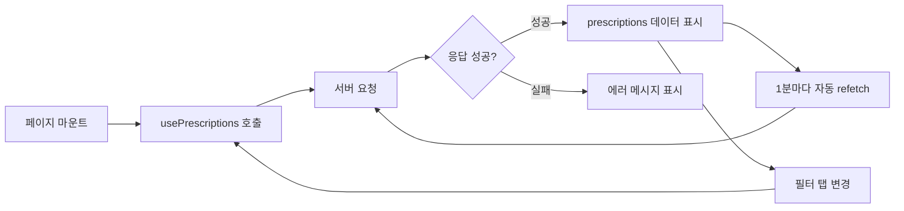
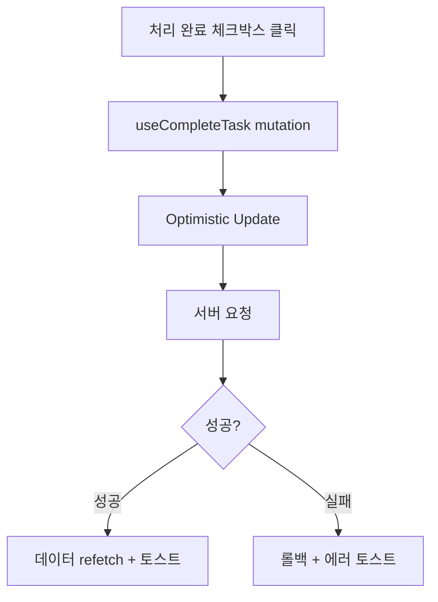
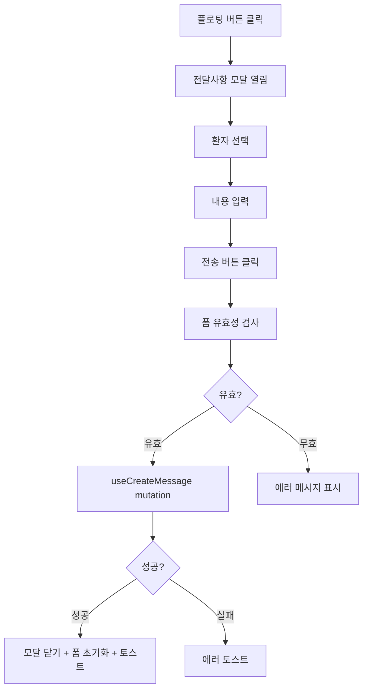

# Nurse (간호사) State Complexity Statement

## State Overview

간호사 페이지는 **낮은 복잡도**의 상태 관리가 필요합니다. 서버 상태(처방 변경 목록)가 주를 이루며, 클라이언트 상태는 최소화합니다.

**복잡도 점수**: 4/10

**주요 특징**:
- 단일 페이지 애플리케이션 (목록만)
- 서버 데이터 조회 및 표시 중심
- 간단한 필터링 (전체/미처리/완료)
- 최소한의 폼 상태 (전달사항 모달)
- 전역 상태 없음 (인증 정보 제외)

---

## State Categories

### Server State (React Query)

서버에서 가져오는 데이터를 관리합니다. React Query를 사용하여 캐싱, 리페칭, 로딩/에러 상태를 자동으로 처리합니다.

```typescript
// 1. 처방 변경 목록
interface PrescriptionsQuery {
  queryKey: ['prescriptions', { date: string; filter: string }];
  queryFn: () => Promise<PrescriptionsResponse>;
  staleTime: 60000; // 1분
  refetchInterval: 60000; // 1분마다 폴링
}

interface PrescriptionsResponse {
  prescriptions: Array<{
    id: string;
    patient: {
      id: string;
      name: string;
      birth_date: string | null;
      gender: 'M' | 'F' | null;
      coordinator_name: string | null;
    };
    consultation: {
      date: string;
      doctor_name: string;
      task_content: string;
      created_at: string;
    };
    task: {
      id: string;
      is_completed: boolean;
      completed_at: string | null;
      completed_by_name: string | null;
    };
  }>;
  summary: {
    total: number;
    pending: number;
    completed: number;
  };
}

// Hook 사용 예시
const usePrescriptions = (
  date: string = format(new Date(), 'yyyy-MM-dd'),
  filter: 'all' | 'pending' | 'completed' = 'all'
) => {
  return useQuery({
    queryKey: ['prescriptions', { date, filter }],
    queryFn: () =>
      apiClient.get(`/api/nurse/prescriptions?date=${date}&filter=${filter}`),
    staleTime: 60000,
    refetchInterval: 60000,
  });
};
```

```typescript
// 2. 전체 환자 목록 (전달사항 작성용)
interface PatientsQuery {
  queryKey: ['patients'];
  queryFn: () => Promise<PatientsResponse>;
  staleTime: 300000; // 5분 (자주 변경되지 않음)
}

interface PatientsResponse {
  patients: Array<{
    id: string;
    name: string;
    coordinator_name: string | null;
  }>;
}

// Hook 사용 예시
const usePatients = () => {
  return useQuery({
    queryKey: ['patients'],
    queryFn: () => apiClient.get('/api/nurse/patients'),
    staleTime: 300000, // 5분
  });
};
```

---

### Server Mutations (React Query)

서버 데이터를 변경하는 작업을 관리합니다.

```typescript
// 1. 처방 변경 건 처리 완료
interface CompleteTaskMutation {
  mutationFn: (params: { taskId: string; memo?: string }) => Promise<void>;
  onSuccess: () => void; // 처방 변경 목록 refetch
  onError: (error: Error) => void; // 에러 토스트 표시
}

// Hook 사용 예시
const useCompleteTask = () => {
  const queryClient = useQueryClient();

  return useMutation({
    mutationFn: ({ taskId, memo }: { taskId: string; memo?: string }) =>
      apiClient.post(`/api/nurse/task/${taskId}/complete`, { memo }),
    onSuccess: () => {
      // 처방 변경 목록 무효화 및 리페치
      queryClient.invalidateQueries(['prescriptions']);
      toast.success('처리 완료했습니다');
    },
    onError: (error) => {
      toast.error('처리 완료에 실패했습니다');
    },
  });
};
```

```typescript
// 2. 전달사항 작성
interface CreateMessageMutation {
  mutationFn: (data: { patient_id: string; content: string }) => Promise<void>;
  onSuccess: () => void; // 모달 닫기 및 폼 초기화
  onError: (error: Error) => void; // 에러 토스트 표시
}

// Hook 사용 예시
const useCreateMessage = () => {
  const queryClient = useQueryClient();

  return useMutation({
    mutationFn: (data: { patient_id: string; content: string; date?: string }) =>
      apiClient.post('/api/nurse/messages', data),
    onSuccess: () => {
      toast.success('전달사항을 전송했습니다');
    },
    onError: (error) => {
      toast.error('전송에 실패했습니다');
    },
  });
};
```

---

### Client State (Zustand) - 없음

전역 클라이언트 상태는 사용하지 않습니다. 인증 정보는 공통 AuthStore를 사용합니다.

```typescript
// 인증 상태 (공통 AuthStore 사용)
import { useAuthStore } from '@/stores/auth';

const PrescriptionsPage = () => {
  const { user, isAuthenticated } = useAuthStore();

  // role='nurse' 확인
  if (!isAuthenticated || user?.role !== 'nurse') {
    redirect('/login');
  }

  // ...
};
```

---

### Local State (useState)

컴포넌트 로컬 상태는 각 페이지/컴포넌트 내부에서만 사용됩니다.

```typescript
// PrescriptionsPage 로컬 상태
interface PrescriptionsPageLocalState {
  filter: 'all' | 'pending' | 'completed'; // 필터 상태
  isMessageModalOpen: boolean; // 전달사항 모달 열림/닫힘
  selectedDate: string; // 날짜 선택 (기본값: 오늘)
}

const PrescriptionsPage = () => {
  const [filter, setFilter] = useState<'all' | 'pending' | 'completed'>('all');
  const [isMessageModalOpen, setIsMessageModalOpen] = useState(false);
  const [selectedDate, setSelectedDate] = useState(format(new Date(), 'yyyy-MM-dd'));

  // ...
};
```

```typescript
// MessageModal 로컬 상태 (react-hook-form 사용)
interface MessageModalLocalState {
  selectedPatientId: string; // 환자 선택
  content: string; // 전달사항 내용
  isSubmitting: boolean; // 전송 중 상태 (react-hook-form이 자동 관리)
}

const MessageModal = ({ isOpen, onClose, onSubmit }: MessageModalProps) => {
  const { register, handleSubmit, reset, formState } = useForm<MessageFormData>({
    resolver: zodResolver(messageSchema),
  });

  // isSubmitting은 formState.isSubmitting으로 접근
};
```

```typescript
// PrescriptionDetailModal 로컬 상태 (선택적)
interface PrescriptionDetailModalLocalState {
  // 상태 없음 (props로만 데이터 전달)
}
```

---

## State Flow

### 1. Prescriptions Page Flow



### 2. Task Completion Flow



### 3. Message Creation Flow



---

## Complexity Analysis

### 복잡도: 4/10 (Low-Medium)

**이유**:
1. **단일 페이지**: 처방 변경 목록 페이지만 존재
2. **서버 상태 중심**: React Query가 자동 관리
3. **간단한 필터링**: URL 쿼리와 로컬 상태로 관리
4. **최소한의 클라이언트 상태**: 필터, 모달 열림/닫힘만
5. **전역 상태 없음**: 페이지 간 공유 상태 없음

**복잡하지 않은 이유**:
- 페이지가 하나뿐 (페이지 간 상태 공유 불필요)
- 데이터 흐름이 단순 (서버 → 화면 표시)
- 실시간 업데이트가 폴링으로 단순하게 처리됨
- 조건부 로직이 거의 없음

**복잡한 부분**:
- React Query 캐싱 전략 이해 필요
- Optimistic update (선택적)

---

## Optimization Strategies

### 1. React Query 최적화

**캐싱 전략**:
```typescript
const queryClient = new QueryClient({
  defaultOptions: {
    queries: {
      staleTime: 60000, // 1분 동안 fresh 유지
      cacheTime: 300000, // 5분 동안 캐시 유지
      refetchOnWindowFocus: true, // 포커스 시 refetch
      retry: 1, // 1회만 재시도
    },
  },
});
```

**선택적 폴링**:
```typescript
// Prescriptions: 1분마다 폴링
const { data } = usePrescriptions(date, filter, {
  refetchInterval: 60000,
});

// Patients: 캐시만 사용 (자주 변경되지 않음)
const { data: patientsData } = usePatients({
  staleTime: 300000, // 5분
  refetchInterval: false, // 폴링 비활성화
});
```

### 2. 메모이제이션

**컴포넌트 메모이제이션**:
```typescript
// 처방 변경 카드는 props가 변경되지 않으면 리렌더링 방지
const PrescriptionCard = React.memo(({ prescription, onComplete }: PrescriptionCardProps) => {
  // ...
});
```

**콜백 메모이제이션**:
```typescript
const PrescriptionsPage = () => {
  const { data } = usePrescriptions(selectedDate, filter);

  // 처리 완료 핸들러 메모이제이션
  const handleComplete = useCallback(async (taskId: string) => {
    await completeTask({ taskId });
  }, [completeTask]);

  return (
    <>
      {data?.prescriptions.map((prescription) => (
        <PrescriptionCard
          key={prescription.id}
          prescription={prescription}
          onComplete={handleComplete}
        />
      ))}
    </>
  );
};
```

### 3. Optimistic Update

처리 완료 체크 시 즉시 UI 업데이트 (서버 응답 대기 없이):

```typescript
const useCompleteTask = () => {
  const queryClient = useQueryClient();

  return useMutation({
    mutationFn: ({ taskId, memo }: { taskId: string; memo?: string }) =>
      apiClient.post(`/api/nurse/task/${taskId}/complete`, { memo }),
    onMutate: async ({ taskId, prescriptionId }) => {
      // 진행 중인 refetch 취소
      await queryClient.cancelQueries(['prescriptions']);

      // 이전 데이터 백업
      const previousData = queryClient.getQueryData(['prescriptions']);

      // Optimistic update
      queryClient.setQueryData(['prescriptions'], (old: any) => ({
        ...old,
        prescriptions: old.prescriptions.map((p: any) =>
          p.id === prescriptionId
            ? {
                ...p,
                task: {
                  ...p.task,
                  is_completed: true,
                  completed_at: new Date().toISOString(),
                },
              }
            : p
        ),
        summary: {
          ...old.summary,
          pending: old.summary.pending - 1,
          completed: old.summary.completed + 1,
        },
      }));

      return { previousData };
    },
    onError: (error, variables, context) => {
      // 에러 시 이전 데이터로 롤백
      queryClient.setQueryData(['prescriptions'], context?.previousData);
      toast.error('처리 완료에 실패했습니다');
    },
    onSettled: () => {
      // 서버 데이터로 동기화
      queryClient.invalidateQueries(['prescriptions']);
    },
  });
};
```

### 4. URL State 동기화

필터 상태를 URL 쿼리와 동기화하여 새로고침 시에도 필터 상태 유지:

```typescript
const PrescriptionsPage = () => {
  const router = useRouter();
  const searchParams = useSearchParams();

  // URL에서 필터 상태 읽기
  const [filter, setFilter] = useState<'all' | 'pending' | 'completed'>(
    (searchParams.get('filter') as 'all' | 'pending' | 'completed') || 'all'
  );

  // 필터 변경 시 URL 업데이트
  const handleFilterChange = useCallback(
    (newFilter: 'all' | 'pending' | 'completed') => {
      setFilter(newFilter);
      router.push(`/nurse/prescriptions?filter=${newFilter}`);
    },
    [router]
  );

  // ...
};
```

---

## State Management Best Practices

### 1. 서버 상태와 클라이언트 상태 분리

**서버 상태 (React Query)**:
- 처방 변경 목록
- 전체 환자 목록

**클라이언트 상태 (useState)**:
- 필터 상태 (URL 쿼리와 동기화)
- 모달 열림/닫힘 상태
- 폼 입력값 (react-hook-form)

### 2. 단일 진실 공급원 (Single Source of Truth)

- 서버 데이터는 React Query 캐시가 유일한 진실 공급원
- 로컬에서 복사본을 만들지 않음
- URL 쿼리가 필터 상태의 진실 공급원

### 3. 명확한 데이터 흐름

```
서버 API → React Query Cache → 컴포넌트 Props → UI
사용자 액션 → Mutation → 서버 업데이트 → Cache Invalidation → 자동 Refetch
필터 변경 → URL 업데이트 → Query Key 변경 → 자동 Refetch
```

### 4. 에러 바운더리

```typescript
// 페이지 레벨 에러 바운더리
const NursePrescriptionsPage = () => {
  return (
    <ErrorBoundary fallback={<ErrorFallback />}>
      <PrescriptionsContent />
    </ErrorBoundary>
  );
};
```

---

## State Comparison: Nurse vs Coordinator

| 항목 | 간호사 (Nurse) | 담당 코디 (Coordinator) |
|------|---------------|------------------------|
| 페이지 수 | 1개 (처방 변경 목록) | 3개 (대시보드, 환자 상세, 전달사항) |
| 복잡도 | 4/10 | 5/10 |
| 서버 쿼리 | 2개 (처방 목록, 환자 목록) | 3개 (담당 환자, 환자 상세, 최근 전달사항) |
| 클라이언트 상태 | 필터, 모달 열림/닫힘 | 필터, 모달 열림/닫힘, 히스토리 펼침 |
| 페이지 간 상태 공유 | 없음 | 없음 (각 페이지 독립적) |
| 필터링 | 3가지 (전체/미처리/완료) | 없음 (담당 환자만) |
| 폴링 | 1분 | 1분 |

**공통점**:
- 서버 상태 중심
- React Query 사용
- 전역 상태 최소화
- Optimistic update 선택적 사용

**차이점**:
- 간호사는 단일 페이지 (더 단순)
- 코디는 환자별 상세 페이지 있음 (약간 더 복잡)

---

*문서 버전: 1.0*
*최종 수정: 2025-01-29*
