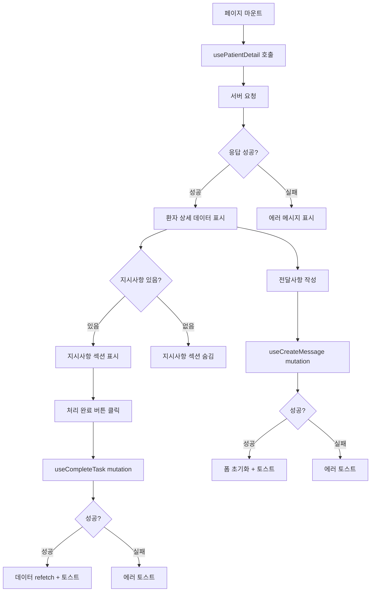
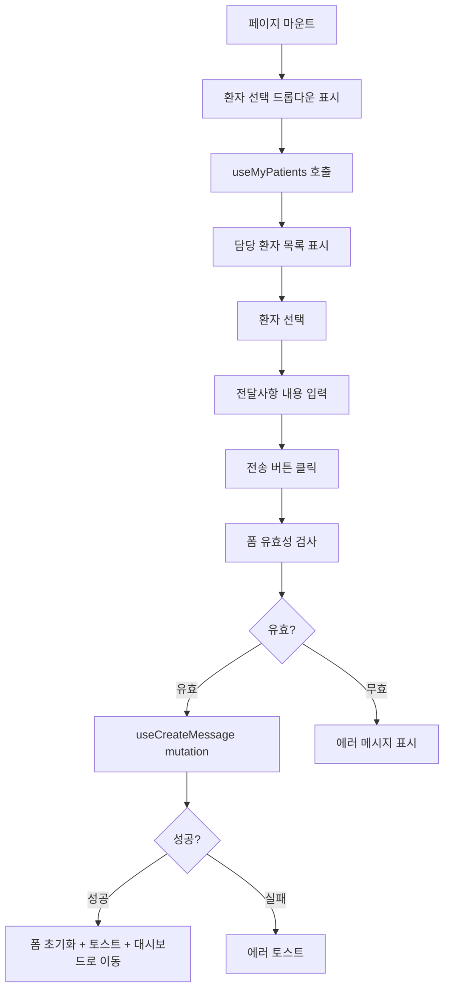

# Staff (담당 코디) State Complexity Statement

## State Overview

담당 코디 페이지는 **중간 복잡도**의 상태 관리가 필요합니다. 서버 상태(환자 목록, 환자 상세)가 주를 이루며, 클라이언트 상태는 최소화합니다.

**복잡도 점수**: 5/10

**주요 특징**:
- 대부분 서버 데이터 조회 및 표시
- 폼 상태 관리 (전달사항 입력)
- 간단한 UI 상태 (히스토리 펼침/접힘)
- 전역 상태 최소화 (인증 정보만)

---

## State Categories

### Server State (React Query)

서버에서 가져오는 데이터를 관리합니다. React Query를 사용하여 캐싱, 리페칭, 로딩/에러 상태를 자동으로 처리합니다.

```typescript
// 1. 담당 환자 목록 (Dashboard)
interface MyPatientsQuery {
  queryKey: ['my-patients', { date: string }];
  queryFn: () => Promise<MyPatientsResponse>;
  staleTime: 60000; // 1분
  refetchInterval: 60000; // 1분마다 폴링
}

interface MyPatientsResponse {
  patients: Array<{
    id: string;
    name: string;
    birth_date: string | null;
    gender: 'M' | 'F' | null;
    attendance: {
      is_attended: boolean;
      checked_at: string | null;
    };
    consultation: {
      is_consulted: boolean;
      has_task: boolean;
      task_completed: boolean;
    };
  }>;
  summary: {
    total: number;
    attended: number;
    consulted: number;
    pending_tasks: number;
  };
}

// Hook 사용 예시
const useMyPatients = (date: string = format(new Date(), 'yyyy-MM-dd')) => {
  return useQuery({
    queryKey: ['my-patients', { date }],
    queryFn: () => apiClient.get(`/api/staff/my-patients?date=${date}`),
    staleTime: 60000,
    refetchInterval: 60000,
  });
};
```

```typescript
// 2. 환자 상세 정보 (Patient Detail)
interface PatientDetailQuery {
  queryKey: ['patient-detail', { patientId: string; date: string }];
  queryFn: () => Promise<PatientDetailResponse>;
  staleTime: 30000; // 30초
  enabled: boolean; // patientId가 있을 때만 실행
}

interface PatientDetailResponse {
  patient: {
    id: string;
    name: string;
    birth_date: string | null;
    gender: 'M' | 'F' | null;
  };
  today: {
    attendance: {
      is_attended: boolean;
      checked_at: string | null;
    };
    consultation: {
      is_consulted: boolean;
      note: string | null;
      doctor_name: string | null;
      created_at: string | null;
    };
    vitals: {
      systolic: number | null;
      diastolic: number | null;
      blood_sugar: number | null;
      recorded_at: string | null;
    } | null;
    task: {
      id: string;
      content: string;
      is_completed: boolean;
      completed_at: string | null;
      completed_by_name: string | null;
    } | null;
  };
  history: Array<{
    date: string;
    note: string;
    doctor_name: string;
    has_task: boolean;
  }>;
}

// Hook 사용 예시
const usePatientDetail = (
  patientId: string | null,
  date: string = format(new Date(), 'yyyy-MM-dd')
) => {
  return useQuery({
    queryKey: ['patient-detail', { patientId, date }],
    queryFn: () => apiClient.get(`/api/staff/patient/${patientId}?date=${date}`),
    staleTime: 30000,
    enabled: !!patientId,
  });
};
```

```typescript
// 3. 최근 전달사항 목록 (선택적)
interface RecentMessagesQuery {
  queryKey: ['recent-messages', { limit: number }];
  queryFn: () => Promise<RecentMessagesResponse>;
  staleTime: 120000; // 2분
}

interface RecentMessagesResponse {
  messages: Array<{
    id: string;
    patient_id: string;
    patient_name: string;
    content: string;
    created_at: string;
    is_read: boolean;
    read_at: string | null;
  }>;
}

// Hook 사용 예시
const useRecentMessages = (limit: number = 10) => {
  return useQuery({
    queryKey: ['recent-messages', { limit }],
    queryFn: () => apiClient.get(`/api/staff/messages/recent?limit=${limit}`),
    staleTime: 120000,
  });
};
```

---

### Server Mutations (React Query)

서버 데이터를 변경하는 작업을 관리합니다.

```typescript
// 1. 지시사항 처리 완료
interface CompleteTaskMutation {
  mutationFn: (params: { taskId: string; memo?: string }) => Promise<void>;
  onSuccess: () => void; // 환자 상세 데이터 refetch
  onError: (error: Error) => void; // 에러 토스트 표시
}

// Hook 사용 예시
const useCompleteTask = () => {
  const queryClient = useQueryClient();

  return useMutation({
    mutationFn: ({ taskId, memo }: { taskId: string; memo?: string }) =>
      apiClient.post(`/api/staff/task/${taskId}/complete`, { memo }),
    onSuccess: (_, { patientId }) => {
      // 환자 상세 데이터 무효화 및 리페치
      queryClient.invalidateQueries(['patient-detail', { patientId }]);
      queryClient.invalidateQueries(['my-patients']);
      toast.success('처리 완료했습니다');
    },
    onError: (error) => {
      toast.error('처리 완료에 실패했습니다');
    },
  });
};
```

```typescript
// 2. 전달사항 작성
interface CreateMessageMutation {
  mutationFn: (data: { patient_id: string; content: string }) => Promise<void>;
  onSuccess: () => void; // 폼 초기화 및 성공 토스트
  onError: (error: Error) => void; // 에러 토스트 표시
}

// Hook 사용 예시
const useCreateMessage = () => {
  const queryClient = useQueryClient();

  return useMutation({
    mutationFn: (data: { patient_id: string; content: string; date?: string }) =>
      apiClient.post('/api/staff/messages', data),
    onSuccess: () => {
      queryClient.invalidateQueries(['recent-messages']);
      toast.success('전달사항을 전송했습니다');
    },
    onError: (error) => {
      toast.error('전송에 실패했습니다');
    },
  });
};
```

---

### Client State (Zustand) - 최소화

전역 클라이언트 상태는 최소한으로 유지합니다. 주로 인증 정보만 전역으로 관리합니다.

```typescript
// 인증 상태 (전역)
interface AuthStore {
  user: {
    id: string;
    login_id: string;
    name: string;
    role: 'coordinator';
  } | null;
  isAuthenticated: boolean;
  login: (credentials: { login_id: string; password: string }) => Promise<void>;
  logout: () => void;
  checkAuth: () => Promise<void>;
}

// Zustand store
import { create } from 'zustand';
import { persist } from 'zustand/middleware';

const useAuthStore = create<AuthStore>()(
  persist(
    (set) => ({
      user: null,
      isAuthenticated: false,
      login: async (credentials) => {
        const response = await apiClient.post('/api/auth/login', credentials);
        set({ user: response.user, isAuthenticated: true });
      },
      logout: () => {
        set({ user: null, isAuthenticated: false });
        // httpOnly 쿠키는 서버에서 삭제
        apiClient.post('/api/auth/logout');
      },
      checkAuth: async () => {
        try {
          const response = await apiClient.get('/api/auth/me');
          set({ user: response.user, isAuthenticated: true });
        } catch {
          set({ user: null, isAuthenticated: false });
        }
      },
    }),
    {
      name: 'auth-storage',
      partialize: (state) => ({ user: state.user }), // user만 localStorage에 저장
    }
  )
);
```

---

### Local State (useState)

컴포넌트 로컬 상태는 각 페이지/컴포넌트 내부에서만 사용됩니다.

```typescript
// DashboardPage 로컬 상태
interface DashboardLocalState {
  selectedDate: string; // 날짜 선택 (기본값: 오늘)
}

const DashboardPage = () => {
  const [selectedDate, setSelectedDate] = useState(format(new Date(), 'yyyy-MM-dd'));

  // ...
};
```

```typescript
// PatientDetailPage 로컬 상태
interface PatientDetailLocalState {
  isHistoryExpanded: boolean; // 히스토리 섹션 펼침/접힘
}

const PatientDetailPage = () => {
  const [isHistoryExpanded, setIsHistoryExpanded] = useState(false);

  // ...
};
```

```typescript
// MessageForm 로컬 상태 (react-hook-form 사용)
interface MessageFormLocalState {
  selectedPatientId: string; // 환자 선택 (Messages 페이지에서만)
  content: string; // 전달사항 내용
  isSubmitting: boolean; // 전송 중 상태 (react-hook-form이 자동 관리)
}

const MessageForm = () => {
  const { register, handleSubmit, reset, formState } = useForm<MessageFormData>({
    resolver: zodResolver(messageSchema),
  });

  // isSubmitting은 formState.isSubmitting으로 접근
};
```

---

## State Flow

### 1. Dashboard Page Flow

```mermaid
flowchart LR
    A[페이지 마운트] --> B[useMyPatients 호출]
    B --> C[서버 요청]
    C --> D{응답 성공?}
    D -->|성공| E[patients 데이터 표시]
    D -->|실패| F[에러 메시지 표시]
    E --> G[1분마다 자동 refetch]
    G --> C
    E --> H[환자 카드 클릭]
    H --> I[/staff/patient/id로 이동]
```

### 2. Patient Detail Page Flow



### 3. Messages Page Flow



---

## Complexity Analysis

### 복잡도: 5/10 (Medium)

**이유**:
1. **서버 상태 중심**: 대부분의 상태가 서버 데이터 조회 및 표시로, React Query가 자동 관리
2. **최소한의 클라이언트 상태**: 전역 상태는 인증 정보만, 로컬 상태는 UI 관련만
3. **단순한 폼 상태**: react-hook-form이 폼 상태 자동 관리
4. **명확한 데이터 흐름**: 서버 → 화면 표시 → 사용자 액션 → 서버 업데이트 → refetch

**복잡하지 않은 이유**:
- 페이지 간 공유 상태 거의 없음
- 실시간 업데이트가 폴링으로 단순하게 처리됨
- 조건부 로직이 많지 않음 (지시사항 있음/없음 정도)

**복잡한 부분**:
- React Query 캐싱 전략 이해 필요
- Optimistic update 필요시 추가 복잡도 증가 (현재는 미사용)

---

## Optimization Strategies

### 1. React Query 최적화

**캐싱 전략**:
```typescript
const queryClient = new QueryClient({
  defaultOptions: {
    queries: {
      staleTime: 60000, // 1분 동안 fresh 유지
      cacheTime: 300000, // 5분 동안 캐시 유지
      refetchOnWindowFocus: true, // 포커스 시 refetch
      retry: 1, // 1회만 재시도
    },
  },
});
```

**선택적 폴링**:
```typescript
// Dashboard: 1분마다 폴링
const { data } = useMyPatients({
  refetchInterval: 60000,
});

// Patient Detail: 수동 refetch만
const { data, refetch } = usePatientDetail(patientId, {
  refetchInterval: false, // 폴링 비활성화
});
```

### 2. 메모이제이션

**컴포넌트 메모이제이션**:
```typescript
// 환자 카드는 props가 변경되지 않으면 리렌더링 방지
const PatientCard = React.memo(({ patient, onClick }: PatientCardProps) => {
  // ...
});
```

**콜백 메모이제이션**:
```typescript
const DashboardPage = () => {
  const { data } = useMyPatients();

  // 환자 클릭 핸들러 메모이제이션
  const handlePatientClick = useCallback((patientId: string) => {
    router.push(`/staff/patient/${patientId}`);
  }, [router]);

  return (
    <>
      {data?.patients.map((patient) => (
        <PatientCard
          key={patient.id}
          patient={patient}
          onClick={handlePatientClick}
        />
      ))}
    </>
  );
};
```

### 3. 지연 로딩

**히스토리 섹션**:
```typescript
// 히스토리 섹션을 펼칠 때만 데이터 fetch
const usePatientHistory = (patientId: string, enabled: boolean) => {
  return useQuery({
    queryKey: ['patient-history', { patientId }],
    queryFn: () => apiClient.get(`/api/staff/patient/${patientId}/history`),
    enabled, // 펼쳤을 때만 실행
  });
};
```

### 4. Optimistic Update (선택적)

지시사항 처리 완료 시 즉시 UI 업데이트 (서버 응답 대기 없이):

```typescript
const useCompleteTask = () => {
  const queryClient = useQueryClient();

  return useMutation({
    mutationFn: ({ taskId, memo }: { taskId: string; memo?: string }) =>
      apiClient.post(`/api/staff/task/${taskId}/complete`, { memo }),
    onMutate: async ({ taskId, patientId }) => {
      // 진행 중인 refetch 취소
      await queryClient.cancelQueries(['patient-detail', { patientId }]);

      // 이전 데이터 백업
      const previousData = queryClient.getQueryData(['patient-detail', { patientId }]);

      // Optimistic update
      queryClient.setQueryData(['patient-detail', { patientId }], (old: any) => ({
        ...old,
        today: {
          ...old.today,
          task: {
            ...old.today.task,
            is_completed: true,
            completed_at: new Date().toISOString(),
          },
        },
      }));

      return { previousData };
    },
    onError: (error, variables, context) => {
      // 에러 시 이전 데이터로 롤백
      queryClient.setQueryData(
        ['patient-detail', { patientId: variables.patientId }],
        context?.previousData
      );
      toast.error('처리 완료에 실패했습니다');
    },
    onSettled: (_, __, { patientId }) => {
      // 서버 데이터로 동기화
      queryClient.invalidateQueries(['patient-detail', { patientId }]);
    },
  });
};
```

---

## State Management Best Practices

### 1. 서버 상태와 클라이언트 상태 분리

**서버 상태 (React Query)**:
- 환자 목록
- 환자 상세 정보
- 최근 전달사항

**클라이언트 상태 (Zustand/useState)**:
- 인증 정보 (전역)
- UI 상태 (로컬)
- 폼 입력값 (로컬)

### 2. 단일 진실 공급원 (Single Source of Truth)

- 서버 데이터는 React Query 캐시가 유일한 진실 공급원
- 로컬에서 복사본을 만들지 않음

### 3. 명확한 데이터 흐름

```
서버 API → React Query Cache → 컴포넌트 Props → UI
사용자 액션 → Mutation → 서버 업데이트 → Cache Invalidation → 자동 Refetch
```

### 4. 에러 바운더리

```typescript
// 페이지 레벨 에러 바운더리
const StaffDashboardPage = () => {
  return (
    <ErrorBoundary fallback={<ErrorFallback />}>
      <DashboardContent />
    </ErrorBoundary>
  );
};
```

---

*문서 버전: 1.0*
*최종 수정: 2025-01-29*
