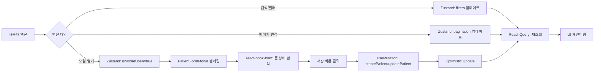
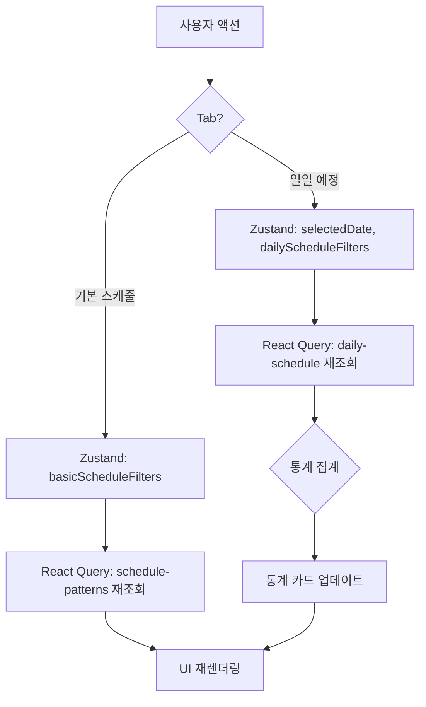

# Admin Pages State Complexity Statement

## Overview

관리자용 4개 페이지의 상태 복잡도를 분석하고 최적의 상태 관리 전략을 제시합니다.

---

## 1. Patients Page (/admin/patients)

### 1.1 State Overview

환자 관리 페이지는 **중간 복잡도 (6/10)** 를 가집니다.

**복잡도 요인**:
- 페이지네이션 상태
- 검색/필터링 상태
- 모달 열림/닫힘 상태
- 폼 입력 상태 (환자 추가/수정)
- 서버 데이터 (환자 목록, 담당 코디 목록)

### 1.2 State Categories

#### Server State (React Query)

```typescript
// 환자 목록 조회
const { data, isLoading } = useQuery({
  queryKey: ['patients', { page, limit, search, status, coordinator_id }],
  queryFn: () => getPatients({ page, limit, search, status, coordinator_id }),
  staleTime: 5 * 60 * 1000, // 5분
});

// 담당 코디 목록 조회 (환자 폼에서 사용)
const { data: coordinators } = useQuery({
  queryKey: ['coordinators'],
  queryFn: () => getCoordinators(),
  staleTime: 10 * 60 * 1000, // 10분 (자주 변경되지 않음)
});

// 환자 생성 mutation
const createPatient = useMutation({
  mutationFn: (data: CreatePatientRequest) => createPatientApi(data),
  onSuccess: () => {
    queryClient.invalidateQueries(['patients']);
    // Optimistic Update 적용 가능
  },
});

// 환자 수정 mutation
const updatePatient = useMutation({
  mutationFn: ({ id, data }: { id: string; data: UpdatePatientRequest }) =>
    updatePatientApi(id, data),
  onSuccess: () => {
    queryClient.invalidateQueries(['patients']);
  },
});
```

**추천 설정**:
- `staleTime`: 5분 (환자 정보는 자주 변경되지 않음)
- `cacheTime`: 10분
- Optimistic Update: 적용 (사용자 경험 향상)

---

#### Client State (Zustand)

```typescript
interface AdminPatientsStore {
  // 필터/검색 상태
  filters: {
    search: string;
    status: 'all' | 'active' | 'discharged' | 'suspended';
    coordinator_id: string | null;
  };
  setFilters: (filters: Partial<AdminPatientsStore['filters']>) => void;

  // 페이지네이션 상태
  pagination: {
    page: number;
    limit: number;
  };
  setPagination: (pagination: Partial<AdminPatientsStore['pagination']>) => void;

  // 모달 상태
  isModalOpen: boolean;
  modalMode: 'create' | 'edit' | null;
  selectedPatient: Patient | null;
  openModal: (mode: 'create' | 'edit', patient?: Patient) => void;
  closeModal: () => void;
}

const useAdminPatientsStore = create<AdminPatientsStore>((set) => ({
  filters: {
    search: '',
    status: 'all',
    coordinator_id: null,
  },
  setFilters: (filters) =>
    set((state) => ({
      filters: { ...state.filters, ...filters },
      pagination: { ...state.pagination, page: 1 }, // 필터 변경 시 1페이지로 리셋
    })),

  pagination: {
    page: 1,
    limit: 20,
  },
  setPagination: (pagination) =>
    set((state) => ({
      pagination: { ...state.pagination, ...pagination },
    })),

  isModalOpen: false,
  modalMode: null,
  selectedPatient: null,
  openModal: (mode, patient) =>
    set({ isModalOpen: true, modalMode: mode, selectedPatient: patient || null }),
  closeModal: () =>
    set({ isModalOpen: false, modalMode: null, selectedPatient: null }),
}));
```

**설명**:
- 필터/페이지네이션은 URL 쿼리 파라미터로 관리 가능하지만, Zustand 사용 시 더 간결
- 모달 상태는 클라이언트 전용 (서버와 무관)

---

#### Local State (useState)

```typescript
// PatientFormModal 컴포넌트 내부
const {
  register,
  handleSubmit,
  formState: { errors },
} = useForm<PatientFormData>({
  resolver: zodResolver(patientFormSchema),
  defaultValues: patient || {
    name: '',
    birth_date: '',
    gender: '',
    coordinator_id: '',
    memo: '',
    schedule_days: [],
  },
});
```

**설명**:
- 폼 입력 상태는 `react-hook-form`으로 관리
- 전역 상태 불필요 (모달 닫으면 폼 리셋)

---

### 1.3 State Flow



---

### 1.4 Complexity Analysis

| 요소 | 복잡도 | 설명 |
|------|--------|------|
| 서버 상태 | Medium | 환자 목록, 담당 코디 목록 |
| 클라이언트 상태 | Low | 필터, 페이지네이션, 모달 |
| 폼 상태 | Medium | 출석 패턴 (다중 체크박스) |
| 비즈니스 로직 | Low | 단순 CRUD |

**총 복잡도**: 6/10

---

### 1.5 Optimization Strategies

1. **React Query 설정 최적화**
   - `staleTime`: 5분 (불필요한 재조회 방지)
   - Optimistic Update: 적용 (UI 즉시 반영)

2. **Debouncing**
   - 검색 입력: 500ms debounce (불필요한 API 호출 방지)

3. **Pagination**
   - 서버 측 페이지네이션 (20명/페이지)
   - 클라이언트 측 캐싱 (React Query)

4. **모달 상태 관리**
   - Zustand로 모달 열림/닫힘 관리
   - 폼 상태는 `react-hook-form`으로 독립 관리

---

## 2. Staff Page (/admin/staff)

### 2.1 State Overview

직원 관리 페이지는 **중간 복잡도 (5/10)** 를 가집니다.

**복잡도 요인**:
- 페이지네이션 상태
- 필터링 상태 (역할, 상태)
- 2개 모달 (직원 추가/수정, 비밀번호 초기화)
- 서버 데이터 (직원 목록)

### 2.2 State Categories

#### Server State (React Query)

```typescript
// 직원 목록 조회
const { data } = useQuery({
  queryKey: ['staff', { page, limit, role, status }],
  queryFn: () => getStaff({ page, limit, role, status }),
  staleTime: 5 * 60 * 1000,
});

// 직원 생성 mutation
const createStaff = useMutation({
  mutationFn: (data: CreateStaffRequest) => createStaffApi(data),
  onSuccess: () => {
    queryClient.invalidateQueries(['staff']);
  },
});

// 직원 수정 mutation
const updateStaff = useMutation({
  mutationFn: ({ id, data }: { id: string; data: UpdateStaffRequest }) =>
    updateStaffApi(id, data),
  onSuccess: () => {
    queryClient.invalidateQueries(['staff']);
  },
});

// 비밀번호 초기화 mutation
const resetPassword = useMutation({
  mutationFn: ({ id, password }: { id: string; password: string }) =>
    resetPasswordApi(id, password),
});
```

---

#### Client State (Zustand)

```typescript
interface AdminStaffStore {
  filters: {
    role: 'all' | 'doctor' | 'coordinator' | 'nurse' | 'admin';
    status: 'all' | 'active' | 'inactive';
  };
  setFilters: (filters: Partial<AdminStaffStore['filters']>) => void;

  pagination: {
    page: number;
    limit: number;
  };
  setPagination: (pagination: Partial<AdminStaffStore['pagination']>) => void;

  isFormModalOpen: boolean;
  formModalMode: 'create' | 'edit' | null;
  selectedStaff: StaffPublic | null;
  openFormModal: (mode: 'create' | 'edit', staff?: StaffPublic) => void;
  closeFormModal: () => void;

  isPasswordResetModalOpen: boolean;
  passwordResetStaff: { id: string; name: string } | null;
  openPasswordResetModal: (staff: { id: string; name: string }) => void;
  closePasswordResetModal: () => void;
}
```

**설명**:
- 2개 모달 상태 관리 (직원 폼, 비밀번호 초기화)
- 필터링 상태 (역할, 활성 상태)

---

### 2.3 Complexity Analysis

| 요소 | 복잡도 | 설명 |
|------|--------|------|
| 서버 상태 | Low | 직원 목록만 |
| 클라이언트 상태 | Medium | 필터, 페이지네이션, 2개 모달 |
| 폼 상태 | Low | 단순 입력 필드 |
| 비즈니스 로직 | Low | CRUD, 비밀번호 해싱(서버) |

**총 복잡도**: 5/10

---

## 3. Schedule Page (/admin/schedule)

### 3.1 State Overview

스케줄 관리 페이지는 **높은 복잡도 (7/10)** 를 가집니다.

**복잡도 요인**:
- 2개 Tab (기본 스케줄, 일일 예정)
- 각 Tab마다 독립적인 상태
- 날짜 선택 상태
- 통계 집계 상태
- 서버 데이터 (패턴 목록, 일일 예정 목록)

### 3.2 State Categories

#### Server State (React Query)

```typescript
// 기본 스케줄 패턴 조회
const { data: patterns } = useQuery({
  queryKey: ['schedule-patterns', { page, limit, search }],
  queryFn: () => getSchedulePatterns({ page, limit, search }),
  staleTime: 5 * 60 * 1000,
});

// 일일 예정 출석 조회
const { data: dailySchedule } = useQuery({
  queryKey: ['daily-schedule', { date, source, status }],
  queryFn: () => getDailySchedule({ date, source, status }),
  staleTime: 3 * 60 * 1000, // 3분 (더 자주 변경됨)
});

// 패턴 수정 mutation
const updatePattern = useMutation({
  mutationFn: ({ patient_id, schedule_days }: UpdateSchedulePatternRequest) =>
    updateSchedulePatternApi(patient_id, schedule_days),
  onSuccess: () => {
    queryClient.invalidateQueries(['schedule-patterns']);
    queryClient.invalidateQueries(['daily-schedule']); // 일일 예정도 영향받음
  },
});

// 수동 예정 추가 mutation
const addManualSchedule = useMutation({
  mutationFn: (data: AddManualScheduleRequest) => addManualScheduleApi(data),
  onSuccess: () => {
    queryClient.invalidateQueries(['daily-schedule']);
  },
});

// 예정 취소 mutation
const cancelSchedule = useMutation({
  mutationFn: ({ id, is_cancelled }: { id: string; is_cancelled: boolean }) =>
    cancelScheduleApi(id, is_cancelled),
  onSuccess: () => {
    queryClient.invalidateQueries(['daily-schedule']);
  },
  // Optimistic Update 적용
  onMutate: async ({ id, is_cancelled }) => {
    await queryClient.cancelQueries(['daily-schedule']);
    const previous = queryClient.getQueryData(['daily-schedule', { date }]);
    queryClient.setQueryData(['daily-schedule', { date }], (old: any) => ({
      ...old,
      data: old.data.map((item: any) =>
        item.id === id ? { ...item, is_cancelled } : item
      ),
    }));
    return { previous };
  },
  onError: (err, variables, context) => {
    queryClient.setQueryData(['daily-schedule', { date }], context?.previous);
  },
});
```

---

#### Client State (Zustand)

```typescript
interface AdminScheduleStore {
  // Tab 상태
  activeTab: 'basic' | 'daily';
  setActiveTab: (tab: 'basic' | 'daily') => void;

  // 기본 스케줄 Tab 상태
  basicScheduleFilters: {
    search: string;
  };
  basicSchedulePagination: {
    page: number;
    limit: number;
  };
  setBasicScheduleFilters: (filters: Partial<AdminScheduleStore['basicScheduleFilters']>) => void;
  setBasicSchedulePagination: (pagination: Partial<AdminScheduleStore['basicSchedulePagination']>) => void;

  isPatternModalOpen: boolean;
  selectedPatientForPattern: { id: string; name: string; schedule_days: number[] } | null;
  openPatternModal: (patient: { id: string; name: string; schedule_days: number[] }) => void;
  closePatternModal: () => void;

  // 일일 예정 Tab 상태
  selectedDate: string; // YYYY-MM-DD
  setSelectedDate: (date: string) => void;

  dailyScheduleFilters: {
    source: 'all' | 'auto' | 'manual';
    status: 'all' | 'active' | 'cancelled';
  };
  setDailyScheduleFilters: (filters: Partial<AdminScheduleStore['dailyScheduleFilters']>) => void;

  isManualAddModalOpen: boolean;
  openManualAddModal: () => void;
  closeManualAddModal: () => void;
}
```

**설명**:
- 2개 Tab의 독립적인 필터/페이지네이션 상태
- 날짜 선택 상태 (일일 예정 Tab)
- 2개 모달 (패턴 수정, 수동 추가)

---

### 3.3 State Flow



---

### 3.4 Complexity Analysis

| 요소 | 복잡도 | 설명 |
|------|--------|------|
| 서버 상태 | High | 패턴 목록, 일일 예정 목록, 통계 |
| 클라이언트 상태 | High | 2개 Tab, 각 Tab마다 독립 상태 |
| 폼 상태 | Medium | 출석 패턴 체크박스, 환자 선택 |
| 비즈니스 로직 | Medium | 패턴 업데이트, 통계 집계 |

**총 복잡도**: 7/10

---

### 3.5 Optimization Strategies

1. **Tab별 독립 상태 관리**
   - Zustand로 각 Tab의 필터/페이지네이션 독립 관리
   - Tab 전환 시 이전 상태 유지

2. **Optimistic Update**
   - 예정 취소 시 즉시 UI 반영 (사용자 경험 향상)

3. **통계 캐싱**
   - 일일 예정 조회 시 통계도 함께 반환 (별도 API 호출 불필요)

4. **날짜 선택 최적화**
   - 날짜 변경 시 즉시 재조회 (debounce 불필요)

---

## 4. Stats Page (/admin/stats)

### 4.1 State Overview

통계 대시보드 페이지는 **중간 복잡도 (6/10)** 를 가집니다.

**복잡도 요인**:
- 날짜 범위 선택 상태
- 차트 데이터 (일별 통계 배열)
- 요약 통계 (평균, 총계)
- 전월 대비 증감률 계산

### 4.2 State Categories

#### Server State (React Query)

```typescript
// 통계 요약 조회
const { data: summary } = useQuery({
  queryKey: ['stats-summary', { start_date, end_date }],
  queryFn: () => getStatsSummary({ start_date, end_date }),
  staleTime: 10 * 60 * 1000, // 10분 (통계는 자주 변경되지 않음)
});

// 일별 통계 조회 (차트용)
const { data: dailyStats } = useQuery({
  queryKey: ['daily-stats', { start_date, end_date }],
  queryFn: () => getDailyStats({ start_date, end_date }),
  staleTime: 10 * 60 * 1000,
});
```

---

#### Client State (Zustand)

```typescript
interface AdminStatsStore {
  dateRange: {
    start: string; // YYYY-MM-DD
    end: string; // YYYY-MM-DD
  };
  setDateRange: (dateRange: Partial<AdminStatsStore['dateRange']>) => void;
}

const useAdminStatsStore = create<AdminStatsStore>((set) => ({
  dateRange: {
    start: format(subDays(new Date(), 30), 'yyyy-MM-dd'), // 기본: 최근 30일
    end: format(new Date(), 'yyyy-MM-dd'),
  },
  setDateRange: (dateRange) =>
    set((state) => ({
      dateRange: { ...state.dateRange, ...dateRange },
    })),
}));
```

**설명**:
- 날짜 범위만 클라이언트 상태 관리
- 차트 데이터는 서버 상태 (React Query)

---

### 4.3 Complexity Analysis

| 요소 | 복잡도 | 설명 |
|------|--------|------|
| 서버 상태 | Medium | 요약 통계, 일별 통계 |
| 클라이언트 상태 | Low | 날짜 범위만 |
| 차트 렌더링 | Medium | recharts LineChart |
| 비즈니스 로직 | Medium | 평균 계산, 증감률 계산 |

**총 복잡도**: 6/10

---

### 4.4 Optimization Strategies

1. **날짜 범위 제한**
   - 최대 1년 (365일) 제한 (성능 고려)
   - 잘못된 범위 입력 시 유효성 검사

2. **차트 데이터 최적화**
   - 서버 측 집계 (daily_stats 테이블)
   - 실시간 집계 X (매일 cron job으로 집계)

3. **React Query 설정**
   - `staleTime`: 10분 (통계는 자주 변경되지 않음)
   - 날짜 범위 변경 시만 재조회

---

## 5. Overall Recommendations

### 5.1 상태 관리 전략 요약

| 페이지 | 복잡도 | Server State | Client State | Local State |
|--------|--------|--------------|--------------|-------------|
| Patients | 6/10 | React Query | Zustand | react-hook-form |
| Staff | 5/10 | React Query | Zustand | react-hook-form |
| Schedule | 7/10 | React Query | Zustand | react-hook-form |
| Stats | 6/10 | React Query | Zustand | - |

### 5.2 공통 패턴

1. **Server State**: React Query
   - 모든 API 데이터
   - Optimistic Update 적용 (사용자 경험 향상)

2. **Client State**: Zustand
   - 필터, 페이지네이션, 모달 상태
   - URL 쿼리 파라미터 대신 Zustand 사용 (간결성)

3. **Local State**: react-hook-form
   - 폼 입력 상태
   - zod 스키마 검증

### 5.3 성능 최적화 전략

1. **React Query 설정**
   ```typescript
   const queryClient = new QueryClient({
     defaultOptions: {
       queries: {
         staleTime: 5 * 60 * 1000, // 5분
         cacheTime: 10 * 60 * 1000, // 10분
         refetchOnWindowFocus: false,
       },
     },
   });
   ```

2. **Debouncing**
   - 검색 입력: 500ms debounce
   - 필터 변경: 즉시 반영

3. **Pagination**
   - 서버 측 페이지네이션 (20개/페이지)
   - 클라이언트 측 캐싱

---

*문서 버전: 1.0*
*작성일: 2025-01-29*
