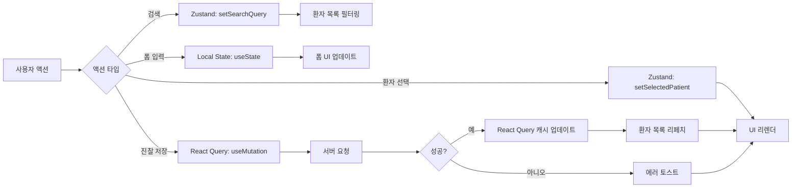

# Doctor Pages State Complexity Statement

## State Overview

의사용 페이지의 전체 상태 구조와 복잡도를 분석하고, 적절한 상태 관리 전략을 제시합니다.

---

## Complexity Score: **6/10** (Medium)

### 복잡도 산정 근거

**높은 복잡도 요인**:
- 여러 API 간 데이터 의존성 (환자 목록 → 전달사항 → 진찰 기록)
- 실시간 업데이트 요구사항 (폴링)
- 키보드 단축키와 폼 상태 동기화
- 낙관적 업데이트 (Optimistic Update)

**낮은 복잡도 요인**:
- 페이지 간 상태 공유 최소 (각 페이지 독립적)
- 서버 상태가 대부분 (React Query로 관리)
- 복잡한 클라이언트 상태 로직 없음

---

## State Categories

### 1. Server State (React Query)

서버에서 가져오는 데이터로, React Query로 관리합니다.

```typescript
// 오늘 출석 환자 목록
interface TodayPatientsState {
  patients: Array<{
    id: string;
    name: string;
    birth_date: string;
    gender: 'M' | 'F';
    coordinator_name: string | null;
    is_attended: boolean;
    checked_at: string | null;
    is_consulted: boolean;
    has_task: boolean;
    unread_message_count: number;
  }>;
  summary: {
    total: number;
    pending: number;
    completed: number;
  };
}

// 환자별 전달사항
interface PatientMessagesState {
  messages: Array<{
    id: string;
    content: string;
    author_name: string;
    author_role: 'coordinator' | 'nurse';
    created_at: string;
    is_read: boolean;
  }>;
}

// 환자별 히스토리
interface PatientHistoryState {
  history: Array<{
    id: string;
    date: string;
    note: string | null;
    has_task: boolean;
    task_content: string | null;
    task_target: 'coordinator' | 'nurse' | 'both' | null;
    doctor_name: string;
  }>;
}

// 처리 필요 목록
interface DoctorTasksState {
  tasks: Array<{
    consultation_id: string;
    patient_id: string;
    patient_name: string;
    task_content: string;
    task_target: 'coordinator' | 'nurse' | 'both';
    coordinator_completed: boolean | null;
    nurse_completed: boolean | null;
    created_at: string;
  }>;
}
```

**React Query 키 구조**:
```typescript
['doctor', 'patients', 'today', date] // 오늘 환자 목록
['doctor', 'patients', patientId, 'messages', date] // 전달사항
['doctor', 'patients', patientId, 'history', days] // 히스토리
['doctor', 'tasks', date, status] // 처리 필요 목록
```

**캐싱 전략**:
- `staleTime`: 5분 (환자 목록, 전달사항)
- `cacheTime`: 10분 (히스토리)
- `refetchInterval`: 5분 (환자 목록만 폴링)

---

### 2. Client State (Zustand)

클라이언트에서 관리하는 전역 상태입니다.

```typescript
interface DoctorConsultationStore {
  // === 환자 선택 상태 ===
  selectedPatientId: string | null;
  setSelectedPatient: (id: string | null) => void;

  // === 검색 상태 ===
  searchQuery: string;
  setSearchQuery: (query: string) => void;
  searchFocused: boolean;
  setSearchFocused: (focused: boolean) => void;

  // === 임시 저장 (Draft) ===
  // 환자별 면담 내용 임시 저장 (페이지 새로고침 시 복원)
  draftNotes: Record<string, string>; // patientId -> note
  saveDraftNote: (patientId: string, note: string) => void;
  clearDraftNote: (patientId: string) => void;

  // === 필터 상태 ===
  statusFilter: 'all' | 'pending' | 'completed';
  setStatusFilter: (filter: 'all' | 'pending' | 'completed') => void;
}

// Zustand 스토어 구현
import { create } from 'zustand';
import { persist } from 'zustand/middleware';

export const useDoctorConsultationStore = create<DoctorConsultationStore>()(
  persist(
    (set) => ({
      selectedPatientId: null,
      setSelectedPatient: (id) => set({ selectedPatientId: id }),

      searchQuery: '',
      setSearchQuery: (query) => set({ searchQuery: query }),
      searchFocused: false,
      setSearchFocused: (focused) => set({ searchFocused: focused }),

      draftNotes: {},
      saveDraftNote: (patientId, note) =>
        set((state) => ({
          draftNotes: { ...state.draftNotes, [patientId]: note },
        })),
      clearDraftNote: (patientId) =>
        set((state) => {
          const { [patientId]: _, ...rest } = state.draftNotes;
          return { draftNotes: rest };
        }),

      statusFilter: 'all',
      setStatusFilter: (filter) => set({ statusFilter: filter }),
    }),
    {
      name: 'doctor-consultation-storage', // localStorage 키
      partialize: (state) => ({ draftNotes: state.draftNotes }), // draftNotes만 저장
    }
  )
);
```

**왜 Zustand를 사용하는가?**
- **전역 상태**: 여러 컴포넌트에서 공유 (검색 상태, 선택된 환자)
- **영속성**: draftNotes는 페이지 새로고침 후에도 유지 필요 (localStorage)
- **간단한 API**: 보일러플레이트 최소화

---

### 3. Local State (useState)

컴포넌트 내부에서만 사용하는 상태입니다.

```typescript
// ConsultationForm 컴포넌트
interface ConsultationFormLocalState {
  note: string; // 면담 내용
  has_task: boolean; // 처리 필요 항목 체크
  task_target: 'coordinator' | 'nurse' | 'both'; // 지시 대상
  task_content: string; // 지시 내용
  isSubmitting: boolean; // 제출 중 여부
}

// MessagesSection 컴포넌트
interface MessagesSectionLocalState {
  expandedMessageId: string | null; // 확장된 메시지 ID
}

// RecentHistorySection 컴포넌트
interface RecentHistorySectionLocalState {
  isExpanded: boolean; // 접기/펼치기 상태
}

// DoctorTasksPage 컴포넌트
interface TasksPageLocalState {
  statusFilter: 'all' | 'pending' | 'completed'; // 필터
}
```

**왜 Local State를 사용하는가?**
- **컴포넌트 격리**: 다른 컴포넌트와 공유할 필요 없음
- **단순성**: useState로 충분히 관리 가능
- **성능**: 리렌더링 범위 최소화

---

## State Flow



### 주요 플로우 설명

1. **환자 선택**:
   ```
   사용자 클릭 → Zustand.setSelectedPatient → 우측 패널 리렌더
   → 전달사항 조회 (React Query) → 히스토리 조회 (React Query)
   ```

2. **검색**:
   ```
   사용자 입력 → Zustand.setSearchQuery → 환자 목록 필터링 (클라이언트)
   → 매칭 환자만 표시
   ```

3. **진찰 저장**:
   ```
   사용자 제출 → 유효성 검사 (Zod) → React Query.useMutation
   → 서버 요청 → 성공 → 낙관적 업데이트 → 환자 목록 리페치
   → 다음 환자 자동 선택
   ```

4. **폴링**:
   ```
   5분 타이머 → React Query.refetchInterval → 서버 요청
   → 캐시 업데이트 → 변경 사항 있으면 UI 업데이트
   ```

---

## State Management Recommendations

### 1. 서버 상태는 React Query로

**이유**:
- 자동 캐싱, 리페칭, 폴링 지원
- 로딩/에러 상태 관리
- Optimistic Update 쉽게 구현

**예시**:
```typescript
const { data, error, isLoading, refetch } = useQuery({
  queryKey: ['doctor', 'patients', 'today', date],
  queryFn: () => fetchTodayPatients(date),
  staleTime: 5 * 60 * 1000,
  refetchInterval: 5 * 60 * 1000,
});
```

### 2. 전역 클라이언트 상태는 Zustand로

**이유**:
- 간단한 API (보일러플레이트 최소)
- 영속성 지원 (persist 미들웨어)
- 타입 안전성

**예시**:
```typescript
const { selectedPatientId, setSelectedPatient } = useDoctorConsultationStore();
```

### 3. 로컬 상태는 useState로

**이유**:
- 단순하고 명확
- 컴포넌트 격리
- 성능 최적화

**예시**:
```typescript
const [note, setNote] = useState('');
const [has_task, setHasTask] = useState(false);
```

---

## Optimization Strategies

### 1. React Query 캐싱

```typescript
// 환자 목록은 5분간 fresh 유지
const { data } = useQuery({
  queryKey: ['doctor', 'patients', 'today', date],
  queryFn: () => fetchTodayPatients(date),
  staleTime: 5 * 60 * 1000, // 5분
  cacheTime: 10 * 60 * 1000, // 10분
});
```

### 2. 낙관적 업데이트

```typescript
const mutation = useMutation({
  mutationFn: createConsultation,
  onMutate: async (newConsultation) => {
    await queryClient.cancelQueries(['doctor', 'patients', 'today']);
    const previousData = queryClient.getQueryData(['doctor', 'patients', 'today']);

    queryClient.setQueryData(['doctor', 'patients', 'today'], (old: any) => ({
      ...old,
      patients: old.patients.map((p: any) =>
        p.id === newConsultation.patient_id
          ? { ...p, is_consulted: true }
          : p
      ),
    }));

    return { previousData };
  },
  onError: (err, newConsultation, context) => {
    queryClient.setQueryData(['doctor', 'patients', 'today'], context?.previousData);
  },
});
```

### 3. 메모이제이션

```typescript
// 환자 목록 필터링 최적화
const filteredPatients = useMemo(() => {
  return patients.filter((p) => matchesChosung(p.name, searchQuery));
}, [patients, searchQuery]);
```

### 4. 컴포넌트 분할

```typescript
// 큰 컴포넌트를 작은 컴포넌트로 분할하여 불필요한 리렌더 방지
<PatientListPanel>
  {patients.map((patient) => (
    <PatientListItem key={patient.id} patient={patient} />
  ))}
</PatientListPanel>
```

### 5. React.memo 사용

```typescript
// 환자 아이템은 props 변경 시에만 리렌더
export const PatientListItem = React.memo<PatientListItemProps>(({ patient, ...props }) => {
  return <div>...</div>;
});
```

---

## State Persistence

### localStorage (Zustand persist)

**저장 대상**:
- `draftNotes`: 환자별 임시 저장된 면담 내용

**저장 키**:
```typescript
'doctor-consultation-storage'
```

**데이터 구조**:
```json
{
  "draftNotes": {
    "patient-uuid-1": "상태 양호, 불면 호전",
    "patient-uuid-2": "두통 지속, 약 변경 필요"
  }
}
```

**사용 시나리오**:
1. 의사가 면담 내용 입력 중 페이지 새로고침
2. localStorage에서 임시 저장된 내용 복원
3. 사용자에게 "임시 저장된 내용이 있습니다. 복원하시겠습니까?" 알림

---

## Error Boundaries

### 컴포넌트 레벨 에러 처리

```typescript
// 환자 목록 조회 실패
if (error) {
  return (
    <ErrorFallback
      error={error}
      resetErrorBoundary={() => refetch()}
      message="환자 목록을 불러올 수 없습니다"
    />
  );
}
```

### 전역 에러 처리

```typescript
// React Query 기본 에러 핸들러
const queryClient = new QueryClient({
  defaultOptions: {
    queries: {
      onError: (error) => {
        console.error('Query error:', error);
        toast.error('데이터를 불러올 수 없습니다');
      },
    },
    mutations: {
      onError: (error) => {
        console.error('Mutation error:', error);
        toast.error('작업을 수행할 수 없습니다');
      },
    },
  },
});
```

---

## State Debugging

### React Query Devtools

```typescript
import { ReactQueryDevtools } from '@tanstack/react-query-devtools';

function App() {
  return (
    <>
      <YourApp />
      <ReactQueryDevtools initialIsOpen={false} />
    </>
  );
}
```

### Zustand Devtools

```typescript
import { devtools } from 'zustand/middleware';

export const useDoctorConsultationStore = create<DoctorConsultationStore>()(
  devtools(
    persist(
      (set) => ({
        // ...
      }),
      { name: 'doctor-consultation-storage' }
    ),
    { name: 'DoctorConsultationStore' }
  )
);
```

---

## Performance Metrics

### 목표 지표

| 지표 | 목표값 |
|------|--------|
| 첫 페이지 로딩 (FCP) | < 1초 |
| 환자 선택 후 상세 표시 | < 200ms |
| 진찰 저장 후 UI 업데이트 | < 100ms (낙관적 업데이트) |
| 폴링 간격 | 5분 |
| 캐시 유효 시간 | 5분 |

### 성능 모니터링

```typescript
// React Query 성능 모니터링
const { data, dataUpdatedAt, isFetching } = useQuery({
  queryKey: ['doctor', 'patients', 'today', date],
  queryFn: () => fetchTodayPatients(date),
  onSuccess: (data) => {
    console.log('Query success at:', new Date(dataUpdatedAt));
  },
});
```

---

## Summary

### 복잡도 점수: 6/10 (Medium)

**권장 상태 관리 전략**:
1. **서버 상태**: React Query (캐싱, 폴링, 낙관적 업데이트)
2. **전역 클라이언트 상태**: Zustand (검색, 선택, 임시 저장)
3. **로컬 상태**: useState (폼 입력, UI 토글)

**핵심 최적화**:
- React Query 캐싱 (5분)
- 낙관적 업데이트 (빠른 UI 반응)
- 메모이제이션 (필터링, 계산)
- 컴포넌트 분할 (리렌더 최소화)

**장점**:
- 명확한 상태 분리 (서버 vs 클라이언트)
- 타입 안전성 (TypeScript)
- 개발자 경험 (Devtools)
- 유지보수성

---

*문서 버전: 1.0*
*최종 수정: 2025-01-29*
