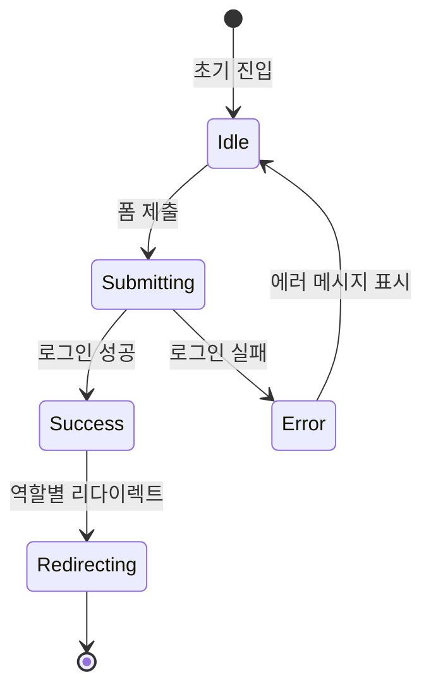

# Login Page State Complexity Statement

## State Overview

로그인 페이지는 **단순한 폼 기반 인증**을 제공하며, 상태 복잡도가 매우 낮습니다. 주로 react-hook-form으로 폼 상태를 관리하고, React Query로 로그인 Mutation을 처리합니다. 전역 상태 관리가 필요하지 않으며, 로그인 성공 시 즉시 리다이렉트되므로 상태 유지가 불필요합니다.

## State Categories

### Server State (React Query)

로그인 Mutation만 사용

```typescript
// 로그인 Mutation
interface LoginMutation {
  mutate: (data: LoginRequest) => void;
  mutateAsync: (data: LoginRequest) => Promise<LoginResponse>;
  isPending: boolean; // 로딩 상태
  isSuccess: boolean; // 성공 여부
  isError: boolean;   // 실패 여부
  error: Error | null;
}
```

**관리 방법**: `@tanstack/react-query`의 `useMutation` 훅 사용

---

### Client State (Zustand)

전역 상태 관리가 필요하지 않음. 로그인 성공 시 JWT 토큰은 httpOnly 쿠키에 저장되며, 클라이언트에서 관리할 필요 없음.

**사용 여부**: ❌ 사용 안 함

---

### Local State (useState, react-hook-form)

폼 상태는 react-hook-form으로 관리

```typescript
// react-hook-form 관리 상태
interface LoginFormState {
  login_id: string; // 아이디 입력값
  password: string; // 비밀번호 입력값
}

// useState 관리 상태 (선택적)
interface AdditionalState {
  showPassword: boolean; // 비밀번호 표시/숨김
}
```

**관리 방법**:
- `react-hook-form`의 `useForm` 훅 (폼 상태 및 검증)
- `useState` 훅 (비밀번호 표시/숨김 토글)

---

## State Flow



### 상태 전환 흐름

1. **Idle (초기 상태)**
   - 사용자가 ID, 비밀번호 입력
   - react-hook-form이 입력값 관리
   - 클라이언트 측 검증 (Zod 스키마)

2. **Submitting (제출 중)**
   - "로그인" 버튼 클릭 시
   - `login.mutate()` 실행
   - `isPending = true` → 버튼 비활성화 및 로딩 표시

3. **Success (성공)**
   - 서버에서 200 OK 응답
   - JWT 토큰이 httpOnly 쿠키에 저장됨 (서버에서 Set-Cookie)
   - `isSuccess = true`
   - 역할별 리다이렉트 (doctor/coordinator/nurse/admin)

4. **Error (실패)**
   - 서버에서 401/403/500 응답
   - `isError = true`
   - 에러 메시지 표시 (ID/비밀번호 불일치, 비활성 계정 등)
   - 다시 Idle 상태로 복귀 (재시도 가능)

---

## Complexity Analysis

### 복잡도 점수: **2/10** (Very Low)

**이유**:

1. **극도로 단순한 흐름**
   - 로그인 → 성공 → 리다이렉트 또는 실패 → 에러 표시
   - 복잡한 상태 전환이나 조건부 로직 없음

2. **최소한의 상태 관리**
   - 폼 상태: react-hook-form이 자동 관리
   - 로그인 상태: React Query가 자동 관리
   - 전역 상태 불필요 (토큰은 쿠키에 저장)

3. **단일 Mutation**
   - 로그인 API 호출만 존재
   - 병렬 요청이나 복잡한 데이터 흐름 없음

4. **즉시 리다이렉트**
   - 로그인 성공 시 페이지를 벗어남
   - 상태 유지가 불필요

**증가 요인** (매우 낮음):
- 에러 처리 (401/403/500 분기)
- 비밀번호 표시/숨김 토글
- 폼 검증 (Zod 스키마)

---

## State Management Strategy

### 권장 방식

```typescript
// src/app/login/page.tsx
'use client';

import { useState } from 'react';
import { useRouter } from 'next/navigation';
import { useForm } from 'react-hook-form';
import { zodResolver } from '@hookform/resolvers/zod';
import { useLogin } from '@/features/auth/hooks';
import { loginSchema, LoginFormData } from '@/features/auth/schema';
import { Eye, EyeOff } from 'lucide-react';

export default function LoginPage() {
  const router = useRouter();
  const [showPassword, setShowPassword] = useState(false);

  // react-hook-form으로 폼 상태 관리
  const form = useForm<LoginFormData>({
    resolver: zodResolver(loginSchema),
    defaultValues: {
      login_id: '',
      password: '',
    },
  });

  // React Query Mutation
  const login = useLogin();

  // 폼 제출 핸들러
  const onSubmit = async (data: LoginFormData) => {
    try {
      const response = await login.mutateAsync(data);

      // 역할별 리다이렉트
      const redirectMap: Record<string, string> = {
        doctor: '/doctor/consultation',
        coordinator: '/staff/dashboard',
        nurse: '/nurse/prescriptions',
        admin: '/admin/patients',
      };

      const redirectUrl = redirectMap[response.user.role];
      router.push(redirectUrl);
    } catch (error) {
      // 에러 처리는 useLogin에서 관리
      // 에러 메시지는 login.error로 접근 가능
    }
  };

  return (
    <div className="min-h-screen flex items-center justify-center bg-gray-100">
      <div className="w-full max-w-md p-8 bg-white rounded-lg shadow-lg">
        <h1 className="text-2xl font-bold text-center mb-6">낮병원 환자관리</h1>

        <form onSubmit={form.handleSubmit(onSubmit)} className="space-y-6">
          {/* 아이디 입력 */}
          <div>
            <label htmlFor="login_id" className="block text-sm font-medium mb-1">
              아이디
            </label>
            <input
              id="login_id"
              type="text"
              {...form.register('login_id')}
              className="w-full px-3 py-2 border rounded-md"
              autoFocus
              aria-invalid={!!form.formState.errors.login_id}
            />
            {form.formState.errors.login_id && (
              <p className="text-red-600 text-sm mt-1">
                {form.formState.errors.login_id.message}
              </p>
            )}
          </div>

          {/* 비밀번호 입력 */}
          <div>
            <label htmlFor="password" className="block text-sm font-medium mb-1">
              비밀번호
            </label>
            <div className="relative">
              <input
                id="password"
                type={showPassword ? 'text' : 'password'}
                {...form.register('password')}
                className="w-full px-3 py-2 border rounded-md pr-10"
                aria-invalid={!!form.formState.errors.password}
              />
              <button
                type="button"
                onClick={() => setShowPassword(!showPassword)}
                className="absolute right-2 top-1/2 -translate-y-1/2"
                aria-label={showPassword ? '비밀번호 숨기기' : '비밀번호 표시'}
              >
                {showPassword ? <EyeOff size={20} /> : <Eye size={20} />}
              </button>
            </div>
            {form.formState.errors.password && (
              <p className="text-red-600 text-sm mt-1">
                {form.formState.errors.password.message}
              </p>
            )}
          </div>

          {/* 에러 메시지 */}
          {login.error && (
            <div role="alert" className="text-red-600 text-sm">
              {getErrorMessage(login.error)}
            </div>
          )}

          {/* 로그인 버튼 */}
          <button
            type="submit"
            disabled={login.isPending}
            className="w-full py-2 bg-primary text-white rounded-md disabled:opacity-50"
          >
            {login.isPending ? '로그인 중...' : '로그인'}
          </button>
        </form>

        <p className="text-center text-sm text-gray-600 mt-4">
          비밀번호를 잊으셨나요?<br />
          → 관리자에게 문의하세요
        </p>
      </div>
    </div>
  );
}

// 에러 메시지 헬퍼 함수
function getErrorMessage(error: unknown): string {
  if (axios.isAxiosError(error)) {
    const status = error.response?.status;

    switch (status) {
      case 400:
        return '입력값을 확인해주세요';
      case 401:
        return '아이디 또는 비밀번호가 일치하지 않습니다';
      case 403:
        return '비활성화된 계정입니다. 관리자에게 문의하세요';
      case 500:
        return '서버 오류가 발생했습니다. 잠시 후 다시 시도해주세요';
      default:
        return '로그인에 실패했습니다. 다시 시도해주세요';
    }
  }

  return '네트워크 연결을 확인해주세요';
}
```

---

## Optimization Strategies

### 1. react-hook-form 사용

폼 상태 관리를 react-hook-form에 위임하여 불필요한 리렌더링 방지

```typescript
const form = useForm<LoginFormData>({
  resolver: zodResolver(loginSchema),
  mode: 'onSubmit', // 제출 시에만 검증 (입력 중 검증 안 함)
});
```

### 2. 즉시 리다이렉트

로그인 성공 시 불필요한 상태 업데이트 없이 즉시 리다이렉트

```typescript
const onSubmit = async (data: LoginFormData) => {
  const response = await login.mutateAsync(data);
  router.push(redirectUrl); // 즉시 리다이렉트
};
```

### 3. 에러 처리 최적화

React Query의 `onError`를 사용하지 않고, try-catch에서 에러 처리

```typescript
const login = useLogin(); // onError 핸들러 없음

const onSubmit = async (data: LoginFormData) => {
  try {
    await login.mutateAsync(data);
    // ...
  } catch (error) {
    // 에러는 login.error로 자동 관리됨
  }
};
```

---

## React Query Hook

### useLogin

```typescript
// src/features/auth/hooks/use-login.ts
import { useMutation } from '@tanstack/react-query';
import { apiClient } from '@/lib/remote/api-client';
import { LoginRequest, LoginResponse } from '../types';

export function useLogin() {
  return useMutation({
    mutationFn: async (data: LoginRequest) => {
      const response = await apiClient.post<LoginResponse>('/api/auth/login', data);
      return response.data.data;
    },
    // onError, onSuccess는 컴포넌트에서 처리
  });
}
```

---

## Error State Management

### 에러 처리 전략

```typescript
// 1. React Query가 에러 상태 자동 관리
const login = useLogin();

// 2. 컴포넌트에서 에러 표시
{login.error && (
  <div role="alert" className="text-red-600 text-sm">
    {getErrorMessage(login.error)}
  </div>
)}

// 3. 에러 메시지 매핑
function getErrorMessage(error: unknown): string {
  if (axios.isAxiosError(error)) {
    const status = error.response?.status;

    switch (status) {
      case 401:
        return '아이디 또는 비밀번호가 일치하지 않습니다';
      case 403:
        return '비활성화된 계정입니다. 관리자에게 문의하세요';
      default:
        return '로그인에 실패했습니다. 다시 시도해주세요';
    }
  }

  return '네트워크 연결을 확인해주세요';
}
```

---

## Testing Considerations

### 폼 검증 테스트

```typescript
test('아이디 미입력 시 에러 메시지 표시', async () => {
  const { result } = renderHook(() => useForm({
    resolver: zodResolver(loginSchema),
  }));

  await act(async () => {
    await result.current.handleSubmit(() => {})({
      login_id: '',
      password: '1234',
    });
  });

  expect(result.current.formState.errors.login_id?.message).toBe('아이디를 입력해주세요');
});
```

### 로그인 성공 테스트

```typescript
test('로그인 성공 시 역할별 리다이렉트', async () => {
  const mockRouter = { push: vi.fn() };
  const { result } = renderHook(() => useLogin());

  mockApiClient.post.mockResolvedValueOnce({
    data: {
      data: {
        user: { role: 'doctor', ... },
        token: 'fake-token',
      },
    },
  });

  await act(async () => {
    await result.current.mutateAsync({ login_id: 'test', password: '1234' });
  });

  expect(mockRouter.push).toHaveBeenCalledWith('/doctor/consultation');
});
```

### 에러 처리 테스트

```typescript
test('로그인 실패 시 에러 메시지 표시', async () => {
  const { result } = renderHook(() => useLogin());

  mockApiClient.post.mockRejectedValueOnce({
    response: { status: 401 },
  });

  await expect(result.current.mutateAsync({ ... })).rejects.toThrow();
  expect(getErrorMessage(result.current.error)).toBe('아이디 또는 비밀번호가 일치하지 않습니다');
});
```

---

## Conclusion

로그인 페이지는 **매우 낮은 상태 복잡도(2/10)**를 가지며, `react-hook-form`과 React Query만으로 충분히 관리 가능합니다. 단순한 폼 기반 인증을 제공하며, 로그인 성공 시 즉시 리다이렉트되므로 복잡한 상태 관리가 불필요합니다. 에러 처리와 폼 검증을 통해 안정적인 사용자 경험을 제공합니다.

---

*문서 버전: 1.0*
*최종 수정: 2025-01-29*
