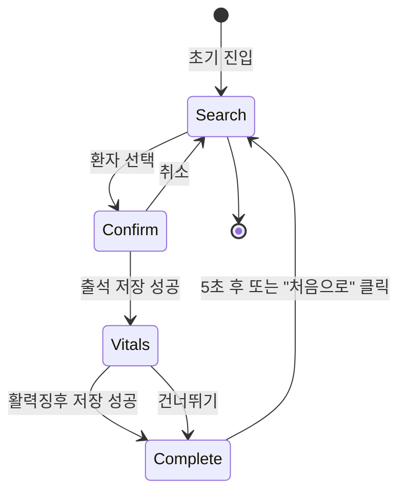

# Patient Page State Complexity Statement

## State Overview

환자용 출석 체크 페이지는 **단계별 마법사(Step Wizard)** 패턴을 사용하며, 상태 복잡도가 낮은 편입니다. 주로 로컬 상태(useState)로 관리하고, 서버 데이터 조회 및 저장은 React Query로 처리합니다.

## State Categories

### Server State (React Query)

서버에서 가져오는 데이터 및 서버로 전송하는 Mutation

```typescript
// 환자 검색 결과
interface SearchPatientsState {
  patients: Array<{ id: string; name: string }>;
  isLoading: boolean;
  error: Error | null;
}

// 출석 여부 확인 (선택적)
interface CheckAttendanceState {
  is_attended: boolean;
  isLoading: boolean;
  error: Error | null;
}

// 출석 기록 저장 Mutation
interface CreateAttendanceMutation {
  mutate: (data: CreateAttendanceRequest) => void;
  isPending: boolean;
  isSuccess: boolean;
  error: Error | null;
}

// 활력징후 저장 Mutation
interface CreateVitalsMutation {
  mutate: (data: CreateVitalsRequest) => void;
  isPending: boolean;
  isSuccess: boolean;
  error: Error | null;
}
```

**관리 방법**: `@tanstack/react-query`의 `useQuery`, `useMutation` 훅 사용

---

### Client State (Zustand)

전역 상태 관리가 필요하지 않음. 환자용 페이지는 독립적이며, 세션 간 데이터 공유가 불필요합니다.

**사용 여부**: ❌ 사용 안 함

---

### Local State (useState)

컴포넌트 로컬 상태로 관리

```typescript
// 페이지 전체 상태
interface PatientCheckInPageState {
  // 현재 단계 ('search' → 'confirm' → 'vitals' → 'complete')
  step: 'search' | 'confirm' | 'vitals' | 'complete';

  // 선택된 환자 정보
  selectedPatient: {
    id: string;
    name: string;
  } | null;

  // 검색어 입력값
  searchQuery: string;

  // 활력징후 입력값 (문자열로 관리, 저장 시 숫자로 변환)
  vitalsInput: {
    systolic: string;    // 수축기 혈압
    diastolic: string;   // 이완기 혈압
    blood_sugar: string; // 혈당
  };
}

// 완료 화면 카운트다운 (CompletionScreen 컴포넌트 내부)
interface CompletionScreenState {
  countdown: number; // 5 → 4 → 3 → 2 → 1 → 0
}
```

**관리 방법**: `useState` 훅 사용

---

## State Flow



### 단계별 상태 전환

1. **Search 단계**
   - `searchQuery` 변경 시 → 환자 검색 (debounce 300ms)
   - 환자 선택 시 → `selectedPatient` 설정 + `step = 'confirm'`

2. **Confirm 단계**
   - "아니오" 클릭 시 → `selectedPatient = null` + `step = 'search'`
   - "예" 클릭 시 → 출석 저장 Mutation 실행
   - 출석 저장 성공 시 → `step = 'vitals'`
   - 출석 저장 실패 시 → 에러 메시지 표시 (step 유지)

3. **Vitals 단계**
   - `vitalsInput` 변경 시 → 상태 업데이트 (제어 컴포넌트)
   - "건너뛰기" 클릭 시 → `step = 'complete'`
   - "저장" 클릭 시 → 활력징후 저장 Mutation 실행
   - 저장 성공 시 → `step = 'complete'`
   - 저장 실패 시 → 에러 메시지 표시 (step 유지)

4. **Complete 단계**
   - 마운트 시 → 5초 타이머 시작
   - 매 초마다 → `countdown` 감소
   - `countdown = 0` 또는 "처음으로" 클릭 시 → 모든 상태 초기화 + `step = 'search'`

---

## Complexity Analysis

### 복잡도 점수: **3/10** (Low)

**이유**:

1. **단순한 단방향 흐름**
   - 명확한 단계별 전환 (Search → Confirm → Vitals → Complete → Search)
   - 복잡한 분기나 병렬 상태 없음

2. **최소한의 상태 관리**
   - 로컬 상태만으로 충분 (전역 상태 불필요)
   - 4개의 단계(step)와 3개의 입력 필드만 관리

3. **서버 상태 격리**
   - React Query가 서버 상태를 자동으로 관리
   - 캐싱, 재시도, 에러 처리 등 자동화

4. **단일 사용자 세션**
   - 세션 간 데이터 공유 불필요
   - 완료 후 상태 초기화로 깨끗한 상태 유지

**증가 요인** (낮음):
- 활력징후 입력값 검증 (숫자 범위, 형식)
- 출석 중복 체크 (이미 출석한 경우)
- 에러 처리 (네트워크 오류, 서버 오류 등)

---

## State Management Strategy

### 권장 방식

```typescript
// src/app/patient/page.tsx
'use client';

import { useState } from 'react';
import { useSearchPatients, useCreateAttendance, useCreateVitals } from '@/features/patient/hooks';

type Step = 'search' | 'confirm' | 'vitals' | 'complete';

export default function PatientCheckInPage() {
  // 로컬 상태
  const [step, setStep] = useState<Step>('search');
  const [selectedPatient, setSelectedPatient] = useState<{ id: string; name: string } | null>(null);
  const [searchQuery, setSearchQuery] = useState('');
  const [vitalsInput, setVitalsInput] = useState({
    systolic: '',
    diastolic: '',
    blood_sugar: '',
  });

  // React Query
  const { data: patients, isLoading: isSearching } = useSearchPatients(searchQuery);
  const createAttendance = useCreateAttendance();
  const createVitals = useCreateVitals();

  // 이벤트 핸들러
  const handlePatientSelect = (patient: { id: string; name: string }) => {
    setSelectedPatient(patient);
    setStep('confirm');
  };

  const handleConfirm = async () => {
    if (!selectedPatient) return;

    try {
      await createAttendance.mutateAsync({
        patient_id: selectedPatient.id,
        date: format(new Date(), 'yyyy-MM-dd'),
      });
      setStep('vitals');
    } catch (error) {
      // 에러 처리 (toast 또는 alert)
    }
  };

  const handleVitalsSave = async () => {
    if (!selectedPatient) return;

    try {
      await createVitals.mutateAsync({
        patient_id: selectedPatient.id,
        date: format(new Date(), 'yyyy-MM-dd'),
        systolic: vitalsInput.systolic ? parseInt(vitalsInput.systolic, 10) : null,
        diastolic: vitalsInput.diastolic ? parseInt(vitalsInput.diastolic, 10) : null,
        blood_sugar: vitalsInput.blood_sugar ? parseInt(vitalsInput.blood_sugar, 10) : null,
      });
      setStep('complete');
    } catch (error) {
      // 에러 처리
    }
  };

  const handleReset = () => {
    setStep('search');
    setSelectedPatient(null);
    setSearchQuery('');
    setVitalsInput({ systolic: '', diastolic: '', blood_sugar: '' });
  };

  // 단계별 렌더링
  return (
    <div className="min-h-screen bg-gray-50">
      {step === 'search' && (
        <PatientSearchSection
          searchQuery={searchQuery}
          onSearchQueryChange={setSearchQuery}
          onPatientSelect={handlePatientSelect}
        />
      )}

      {step === 'confirm' && selectedPatient && (
        <ConfirmationModal
          patient={selectedPatient}
          isOpen={true}
          onCancel={handleReset}
          onConfirm={handleConfirm}
        />
      )}

      {step === 'vitals' && selectedPatient && (
        <VitalsInputSection
          patientName={selectedPatient.name}
          vitalsInput={vitalsInput}
          onVitalsInputChange={(field, value) => {
            setVitalsInput((prev) => ({ ...prev, [field]: value }));
          }}
          onSkip={() => setStep('complete')}
          onSave={handleVitalsSave}
          isSaving={createVitals.isPending}
        />
      )}

      {step === 'complete' && selectedPatient && (
        <CompletionScreen
          patientName={selectedPatient.name}
          onReset={handleReset}
        />
      )}
    </div>
  );
}
```

---

## Optimization Strategies

### 1. Debounce 검색

검색어 입력 시 과도한 API 호출 방지

```typescript
import { debounce } from 'es-toolkit';
import { useMemo } from 'react';

const debouncedSetSearchQuery = useMemo(
  () => debounce((query: string) => setSearchQuery(query), 300),
  []
);
```

### 2. React Query 캐싱

환자 검색 결과를 5분간 캐시하여 불필요한 재조회 방지

```typescript
const { data: patients } = useQuery({
  queryKey: ['patients', 'search', searchQuery],
  queryFn: () => fetchPatients(searchQuery),
  staleTime: 5 * 60 * 1000, // 5분
  enabled: searchQuery.length > 0,
});
```

### 3. 조건부 렌더링

현재 step에 해당하는 컴포넌트만 렌더링하여 불필요한 DOM 생성 방지

```typescript
{step === 'search' && <PatientSearchSection />}
{step === 'confirm' && <ConfirmationModal />}
{step === 'vitals' && <VitalsInputSection />}
{step === 'complete' && <CompletionScreen />}
```

### 4. 메모이제이션 (필요 시)

컴포넌트가 복잡해지면 `useMemo`, `useCallback` 사용 고려

```typescript
const handlePatientSelect = useCallback((patient: { id: string; name: string }) => {
  setSelectedPatient(patient);
  setStep('confirm');
}, []);
```

---

## Error State Management

### 에러 처리 전략

```typescript
// 1. React Query 자동 재시도 (네트워크 오류)
const createAttendance = useMutation({
  mutationFn: createAttendanceFn,
  retry: 2, // 2번 재시도
  retryDelay: 1000, // 1초 간격
});

// 2. 에러 메시지 표시 (toast 또는 alert)
const handleConfirm = async () => {
  try {
    await createAttendance.mutateAsync({ ... });
    setStep('vitals');
  } catch (error) {
    const errorMessage = handleApiError(error);
    toast.error(errorMessage);
  }
};

// 3. 409 Conflict (이미 출석한 경우) 처리
if (error.response?.status === 409) {
  toast.error('이미 출석하셨습니다');
  handleReset(); // 처음으로 돌아가기
}
```

---

## Testing Considerations

### 상태 전환 테스트

```typescript
// 단계별 전환이 올바르게 동작하는지 확인
test('환자 선택 시 confirm 단계로 전환', () => {
  const { result } = renderHook(() => usePatientCheckInState());

  act(() => {
    result.current.handlePatientSelect({ id: '123', name: '홍길동' });
  });

  expect(result.current.step).toBe('confirm');
  expect(result.current.selectedPatient?.name).toBe('홍길동');
});
```

### 에러 처리 테스트

```typescript
test('출석 저장 실패 시 에러 메시지 표시', async () => {
  const { result } = renderHook(() => useCreateAttendance());

  mockApiClient.post.mockRejectedValueOnce(new Error('Network error'));

  await expect(result.current.mutateAsync({ ... })).rejects.toThrow();
  expect(toast.error).toHaveBeenCalledWith('네트워크 연결을 확인해주세요');
});
```

---

## Conclusion

환자용 출석 체크 페이지는 **낮은 상태 복잡도(3/10)**를 가지며, `useState`와 React Query만으로 충분히 관리 가능합니다. 단계별 마법사 패턴을 사용하여 사용자 경험을 단순하고 직관적으로 유지하며, 에러 처리와 최적화를 통해 안정적인 동작을 보장합니다.

---

*문서 버전: 1.0*
*최종 수정: 2025-01-29*
