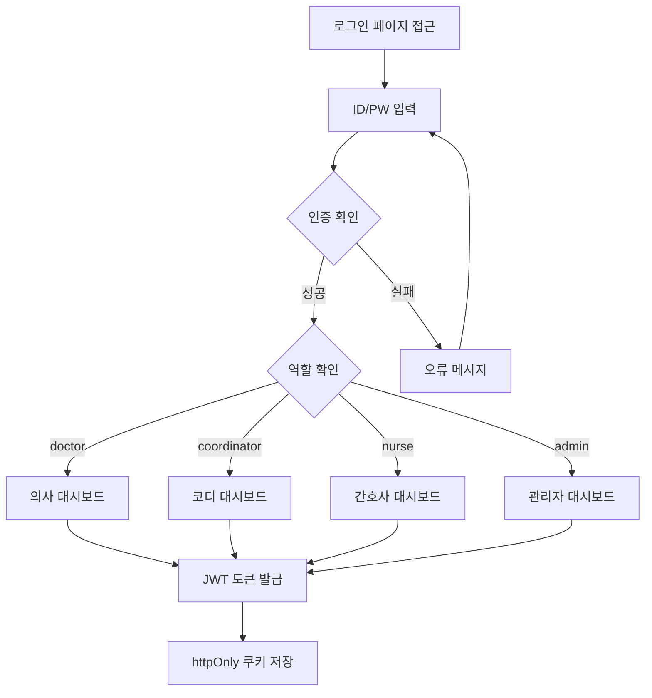
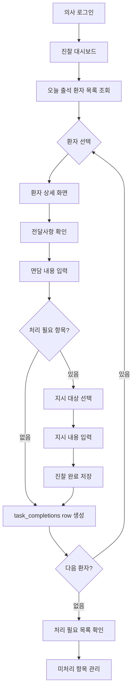
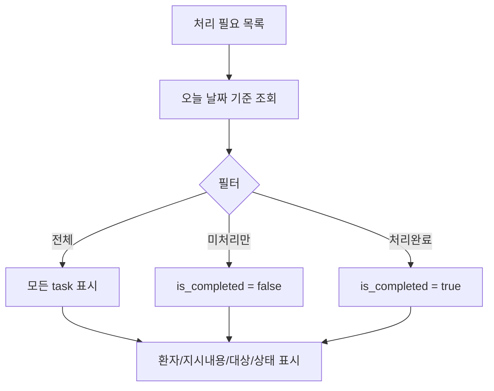
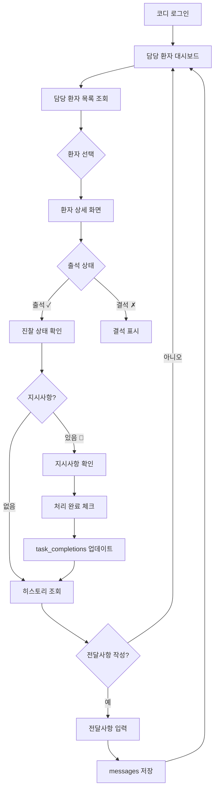
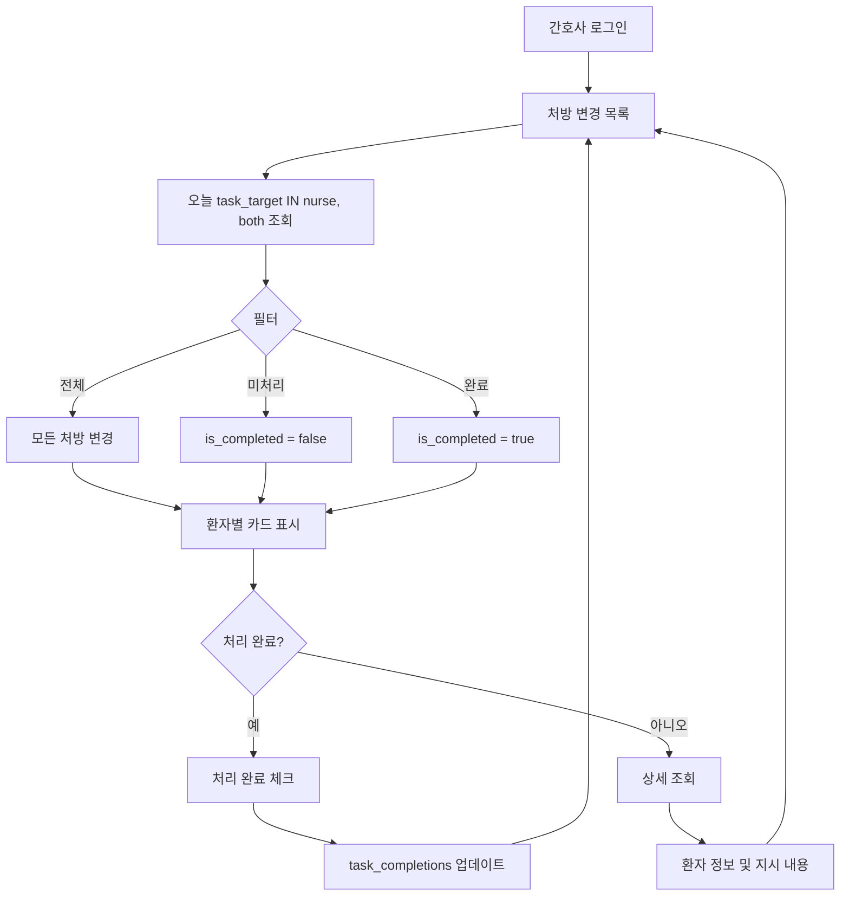
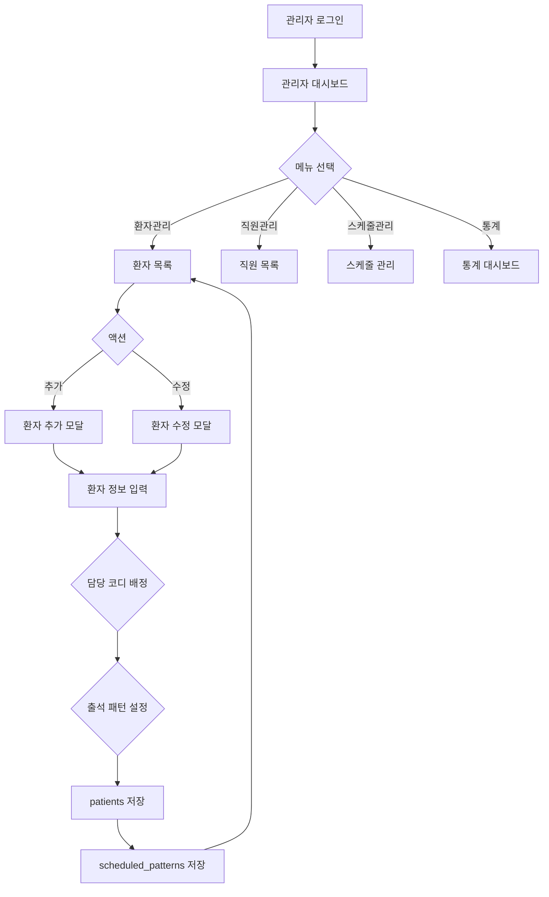

# User Flow

## Overview

낮병원 환자 관리 시스템의 주요 사용자 여정 및 페이지 전환 흐름을 정의합니다.

### 주요 사용자 역할
- **환자**: 출석 체크 및 활력징후 입력 (인증 불필요)
- **담당 코디 (사회복지사)**: 담당 환자 관리, 지시사항 확인 및 처리
- **낮병동 간호사**: 처방 변경 건 확인 및 처리
- **의사**: 진찰 기록, 처방 지시, 전달사항 확인
- **관리자**: 환자/직원 관리, 스케줄 관리, 통계 조회

---

## 1. 환자 출석 Flow

### 1.1 기본 출석 프로세스

```mermaid
flowchart TD
    A[환자 도착] --> B[/patient 페이지 접근]
    B --> C[이름 검색/선택]
    C --> D{환자 확인}
    D -->|올바른 환자| E[출석 확인 모달]
    D -->|잘못 선택| C
    E --> F{출석 체크?}
    F -->|예| G[출석 기록 저장]
    F -->|아니오| C
    G --> H[활력징후 입력 화면]
    H --> I{활력징후 입력?}
    I -->|입력| J[혈압/혈당 입력]
    I -->|건너뛰기| K[완료 화면]
    J --> L[저장]
    L --> K
    K --> M{5초 대기}
    M --> N[처음으로 자동 이동]
    N --> B
```

### 1.2 Steps

1. **환자 도착 및 페이지 접근**
   - 병원 내 태블릿/데스크탑에서 `/patient` 접근
   - 로그인 불필요

2. **이름 검색 및 선택**
   - 큰 검색창에 이름 입력
   - 자동완성 목록에서 본인 이름 선택
   - 글씨 크기 최소 24px, 터치 영역 50px 이상

3. **출석 확인**
   - "홍길동 님, 출석하시겠습니까?" 확인 모달
   - 큰 버튼: "아니오" / "예"

4. **출석 기록 저장**
   - attendances 테이블에 저장
   - date: 오늘 날짜
   - checked_at: 현재 시각

5. **활력징후 입력 (선택사항)**
   - 혈압 (수축기/이완기) 입력 필드
   - 혈당 입력 필드
   - "건너뛰기" / "저장" 버튼

6. **완료 화면**
   - "✓ 홍길동 님, 오늘도 좋은 하루 되세요!"
   - 5초 후 자동으로 처음 화면으로 이동
   - "처음으로" 버튼 (즉시 이동)

### 1.3 Error Cases

| 에러 상황 | 처리 방법 |
|----------|----------|
| 이름 검색 결과 없음 | "검색 결과가 없습니다" 메시지 표시 |
| 이미 출석한 환자 | "이미 출석하셨습니다" 알림 후 처음으로 |
| 네트워크 오류 | "잠시 후 다시 시도해주세요" 메시지 표시 |
| 활력징후 저장 실패 | 출석은 완료, 활력징후만 재입력 안내 |

---

## 2. 직원/의사 인증 Flow

### 2.1 로그인 프로세스



### 2.2 Steps

1. **로그인 페이지 접근** (`/login`)
   - ID 입력 필드
   - 비밀번호 입력 필드
   - "로그인" 버튼

2. **인증 처리**
   - staff 테이블에서 login_id 조회
   - bcrypt로 비밀번호 검증
   - is_active 확인

3. **토큰 발급**
   - JWT 토큰 생성 (유효기간: 8시간)
   - Payload: { id, login_id, name, role }
   - httpOnly 쿠키로 저장

4. **역할별 리다이렉트**
   - doctor → `/doctor/consultation`
   - coordinator → `/staff/dashboard`
   - nurse → `/nurse/prescriptions`
   - admin → `/admin/patients`

### 2.3 Error Cases

| 에러 상황 | 처리 방법 |
|----------|----------|
| ID 또는 비밀번호 오류 | "아이디 또는 비밀번호가 일치하지 않습니다" |
| 비활성화된 계정 | "비활성화된 계정입니다. 관리자에게 문의하세요" |
| 네트워크 오류 | "로그인에 실패했습니다. 다시 시도해주세요" |
| 토큰 만료 | 자동 로그아웃 후 로그인 페이지로 리다이렉트 |

---

## 3. 의사 진찰 Flow

### 3.1 진찰 프로세스



### 3.2 Steps

1. **진찰 대시보드** (`/doctor/consultation`)
   - 왼쪽: 오늘 출석 환자 목록
     - ⏳ 대기 (진찰 전)
     - ✓ 완료 (진찰 후)
     - 💬 전달사항 있음
     - 🔔 처리 필요
   - 오른쪽: 선택된 환자 상세 정보

2. **환자 검색 및 선택**
   - 검색창: Ctrl+K 또는 `/` 로 포커스
   - 초성 검색 지원 (예: "ㅎㄱㄷ" → 홍길동)
   - 목록에서 환자 클릭

3. **전달사항 확인**
   - 담당 코디/간호사가 작성한 messages 조회
   - 미확인 메시지 표시 (💬 아이콘)
   - 확인 시 is_read = true 업데이트

4. **진찰 기록 작성**
   - note 필드: 면담 내용, 상태, 증상
   - 최근 기록 (1개월) 하단에 표시

5. **처리 필요 항목 체크**
   - has_task 체크박스
   - 체크 시 확장 영역 표시:
     - 지시 대상: 담당코디 / 간호사 / 둘다
     - 지시 내용: 자유 텍스트

6. **진찰 완료**
   - consultations 테이블에 저장
   - task_target이 'both'인 경우:
     - task_completions 2개 row 생성 (coordinator, nurse 각각)
   - 그 외:
     - task_completions 1개 row 생성

7. **키보드 단축키**
   - `Enter`: 진찰 완료 + 저장
   - `Tab`: 다음 필드로 이동
   - `Ctrl+T`: 처리 필요 체크 토글
   - `Esc`: 검색창으로 복귀

### 3.3 처리 필요 목록 화면 (`/doctor/tasks`)



### 3.4 Error Cases

| 에러 상황 | 처리 방법 |
|----------|----------|
| 진찰 기록 저장 실패 | "저장에 실패했습니다" 알림, 재시도 유도 |
| 이미 진찰한 환자 | "이미 진찰한 환자입니다" 경고 표시 |
| 처리 필요 항목 내용 누락 | "지시 내용을 입력해주세요" 유효성 검사 |

---

## 4. 담당 코디 Flow

### 4.1 담당 환자 관리



### 4.2 Steps

1. **대시보드** (`/staff/dashboard`)
   - 담당 환자 요약
     - 출석 인원
     - 진찰 완료 인원
     - 처리 필요 항목 개수
   - 환자 목록 카드
     - 출석 상태 (✓/✗)
     - 진찰 상태 (✓/⏳)
     - 지시사항 (🔔)

2. **환자 상세** (`/staff/patient/[id]`)
   - 오늘 상태
     - 출석 시각
     - 진찰 여부
     - 활력징후
   - 지시사항 (있는 경우)
     - 지시 내용 표시
     - "처리 완료 체크" 버튼
   - 전달사항 작성 폼
     - 내용 입력 (textarea)
     - "전송" 버튼
   - 최근 기록 (접기/펼치기)

3. **지시사항 처리**
   - task_completions 테이블에서 해당 consultation_id, role='coordinator' 조회
   - is_completed = true 업데이트
   - completed_at = 현재 시각
   - completed_by = 로그인한 코디 ID

4. **전달사항 작성**
   - messages 테이블에 저장
   - author_id: 로그인한 코디 ID
   - author_role: 'coordinator'
   - patient_id, date, content

### 4.3 Error Cases

| 에러 상황 | 처리 방법 |
|----------|----------|
| 처리 완료 체크 실패 | "처리 완료 등록에 실패했습니다" 알림 |
| 전달사항 내용 누락 | "전달사항 내용을 입력해주세요" 유효성 검사 |
| 담당 환자 아님 | "담당 환자가 아닙니다" 접근 제한 |

---

## 5. 간호사 Flow

### 5.1 처방 변경 관리



### 5.2 Steps

1. **처방 변경 목록** (`/nurse/prescriptions`)
   - 필터: 전체 / 미처리 / 완료
   - 환자 카드
     - 환자 이름
     - 담당 코디
     - 지시 내용
     - 처리 완료 체크박스
     - "상세" 버튼

2. **처리 완료**
   - task_completions 테이블에서 해당 consultation_id, role='nurse' 조회
   - is_completed = true 업데이트
   - completed_at = 현재 시각
   - completed_by = 로그인한 간호사 ID

3. **전달사항 작성**
   - messages 테이블에 저장
   - author_role: 'nurse'

### 5.3 Error Cases

| 에러 상황 | 처리 방법 |
|----------|----------|
| 처리 완료 체크 실패 | "처리 완료 등록에 실패했습니다" 알림 |
| 네트워크 오류 | "목록을 불러올 수 없습니다" 재시도 버튼 |

---

## 6. 관리자 Flow

### 6.1 환자 관리



### 6.2 환자 관리 Steps (`/admin/patients`)

1. **환자 목록 조회**
   - 검색: 이름
   - 필터: 상태 (전체/활성/퇴원/중단), 담당 코디
   - 테이블 컬럼:
     - 이름
     - 생년월일
     - 담당 코디
     - 출석 패턴 (월,수,금 등)
     - 상태
     - 관리 (수정 버튼)

2. **환자 추가**
   - 이름 (필수)
   - 생년월일
   - 성별 (M/F)
   - 담당 코디 (드롭다운)
   - 출석 패턴 (월~금 체크박스)
   - 메모
   - "저장" 버튼 → patients 및 scheduled_patterns 저장

3. **환자 수정**
   - 기존 정보 로드
   - 수정 가능한 필드: 이름, 생년월일, 성별, 담당 코디, 출석 패턴, 메모, 상태
   - "저장" 버튼 → patients 및 scheduled_patterns 업데이트

### 6.3 직원 관리 Steps (`/admin/staff`)

1. **직원 목록 조회**
   - 필터: 역할 (전체/의사/코디/간호사/관리자), 상태 (전체/활성/비활성)
   - 테이블 컬럼:
     - 이름
     - 로그인 ID
     - 역할
     - 상태
     - 관리 (수정/비밀번호 초기화)

2. **직원 추가**
   - 이름 (필수)
   - 로그인 ID (필수, unique)
   - 비밀번호 (필수)
   - 역할 (필수)
   - "저장" 버튼 → staff 저장 (bcrypt 해싱)

3. **비밀번호 초기화**
   - 새 비밀번호 입력
   - bcrypt 해싱 후 password_hash 업데이트

### 6.4 스케줄 관리 Steps (`/admin/schedule`)

1. **일일 예정 출석 조회**
   - 날짜 선택
   - scheduled_attendances 조회
   - 수동 추가/취소 기능

2. **일일 예정 출석 자동 생성**
   - 매일 scheduled_patterns 기반으로 scheduled_attendances 생성
   - Edge Function 또는 cron job

### 6.5 통계 대시보드 (`/admin/stats`)

1. **주요 지표**
   - 평균 출석률 (기간별)
   - 평균 진찰 참석률
   - 오늘 출석 현황

2. **일별 출석률 추이**
   - 차트 (선 그래프)
   - daily_stats 테이블 기반

### 6.6 Error Cases

| 에러 상황 | 처리 방법 |
|----------|----------|
| 환자 추가 실패 | "환자 등록에 실패했습니다" 알림 |
| 로그인 ID 중복 | "이미 사용 중인 ID입니다" 유효성 검사 |
| 비밀번호 초기화 실패 | "비밀번호 초기화에 실패했습니다" 알림 |

---

## 7. Page Transitions

### 7.1 전체 페이지 구조

```
/ (root)
│
├─ /patient (환자용, 인증 불필요)
│
├─ /login (직원/의사 로그인)
│
├─ /doctor (의사용, 인증 필요)
│  ├─ /consultation (진찰 메인)
│  ├─ /tasks (처리 필요 목록)
│  └─ /history/[id] (환자 히스토리)
│
├─ /staff (담당 코디용, 인증 필요)
│  ├─ /dashboard (대시보드)
│  ├─ /patient/[id] (환자 상세)
│  └─ /messages (전달사항 작성)
│
├─ /nurse (간호사용, 인증 필요)
│  └─ /prescriptions (처방 변경 목록)
│
└─ /admin (관리자용, 인증 필요)
   ├─ /patients (환자 관리)
   ├─ /staff (직원 관리)
   ├─ /schedule (스케줄 관리)
   └─ /stats (통계 대시보드)
```

### 7.2 역할별 첫 페이지

| 역할 | 로그인 후 첫 페이지 |
|------|-------------------|
| doctor | `/doctor/consultation` |
| coordinator | `/staff/dashboard` |
| nurse | `/nurse/prescriptions` |
| admin | `/admin/patients` |

### 7.3 인증 미들웨어

- 로그인 필요 페이지 접근 시 JWT 토큰 확인
- 토큰 없음 → `/login` 리다이렉트
- 토큰 만료 → 자동 로그아웃 후 `/login` 리다이렉트
- 역할 불일치 → 403 Forbidden 또는 역할별 첫 페이지로 리다이렉트

---

## 8. 에러 처리 전략

### 8.1 공통 에러 처리

| 에러 코드 | 상황 | 처리 방법 |
|----------|------|----------|
| 400 | Bad Request (잘못된 요청) | "입력값을 확인해주세요" 메시지 표시 |
| 401 | Unauthorized (인증 실패) | 자동 로그아웃 후 로그인 페이지로 리다이렉트 |
| 403 | Forbidden (권한 없음) | "접근 권한이 없습니다" 알림 |
| 404 | Not Found (리소스 없음) | "요청하신 정보를 찾을 수 없습니다" |
| 500 | Internal Server Error | "서버 오류가 발생했습니다. 잠시 후 다시 시도해주세요" |

### 8.2 네트워크 오류

- 타임아웃: "네트워크 연결을 확인해주세요"
- 오프라인: "인터넷 연결이 필요합니다"

### 8.3 유효성 검사

- 클라이언트 측: zod 스키마로 즉시 검증
- 서버 측: 동일한 zod 스키마로 재검증
- 오류 메시지: 사용자 친화적으로 표시

---

## 9. 실시간 업데이트 전략

### 9.1 폴링 (Polling)

- 의사 진찰 화면: 5분마다 환자 목록 갱신
- 코디/간호사 대시보드: 1분마다 상태 갱신

### 9.2 수동 새로고침

- 모든 목록 화면에 "새로고침" 버튼 제공

### 9.3 향후 확장 (Phase 2)

- Supabase Realtime으로 실시간 구독
- 푸시 알림 (처방 변경 시 담당자에게 알림)

---

## 10. 모바일 반응형 고려사항

### 10.1 Breakpoints

| 디바이스 | 화면 크기 | 레이아웃 |
|---------|----------|---------|
| Mobile | < 768px | 단일 컬럼, 햄버거 메뉴 |
| Tablet | 768px ~ 1024px | 2컬럼 가능 |
| Desktop | > 1024px | 다중 컬럼, 사이드바 |

### 10.2 터치 최적화

- 모바일에서 버튼 최소 높이: 44px
- 터치 영역 최소: 48px x 48px
- 환자용 UI: 터치 영역 60px 이상

---

*문서 버전: 1.1*
*최종 수정: 2025-01-23*
